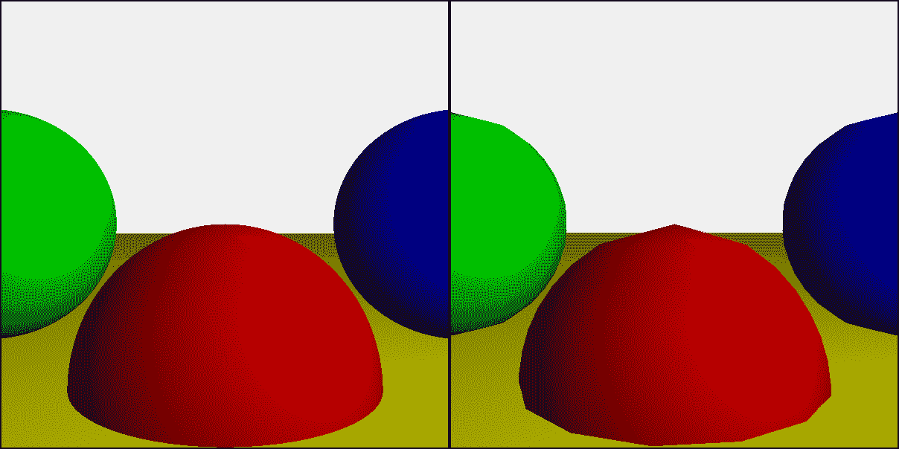

# 零、简介

> 原文:[https://gabrielgambetta . com/computer-graphics-from scratch/00-introduction . html](https://gabrielgambetta.com/computer-graphics-from-scratch/00-introduction.html)

计算机图形学是一个迷人的话题。你如何从一些算法和一些几何数据到电影的特效，如《星球大战》和《T2》【复仇者联盟】，动画电影如《T4》【玩具总动员】和*《冰雪奇缘》*，或者流行视频游戏如*《堡垒之夜》*或*《使命召唤》*？

计算机图形学也是一个非常广泛的话题:从渲染 3D 场景到创建图像过滤器，从数字印刷到模拟粒子系统，有许多学科可以被认为是计算机图形学的一部分。一本书不可能涵盖所有这些主题；这需要一个图书馆。这本书专门关注渲染 3D 场景的主题。

《从零开始的计算机图形学》是我用一种通俗易懂的方式来展示这一幅计算机图形学的浅显尝试。它是为了让高中生容易理解而编写的，同时对专业工程师保持足够的严谨性。它涵盖了与整个大学课程相同的主题——事实上，它是基于我在大学教授这门课程的多年经验。

## [这本书是给谁的](#who-this-book-is-for)

这本书适合所有对计算机图形感兴趣的人，从高中生到经验丰富的专业人士。

我有意识地选择在演示中保持简单明了。这体现在书中对思想和算法的选择上。虽然算法是行业标准的，但每当有多种方法可以实现某个结果时，我都会选择最容易理解的一种。与此同时，我已经付出了相当大的努力，以确保没有挥手或欺骗。我努力记住阿尔伯特·爱因斯坦的建议:“一切都应该尽可能简单，但不能再简单了。”

几乎没有先决知识，也没有硬件或软件依赖性。本书中使用的唯一原语是一种让我们设置像素颜色的方法——从零开始尽可能接近*和*。这些算法在概念上很简单，数学也很简单——最多只是高中三角学的一点点。我们也使用一些线性代数，但这本书包括一个简短的附录，以非常实用的方式介绍了我们需要的一切。

## [这本书涵盖的内容](#what-this-book-covers)

这本书从零开始，建立了两个完整的，功能齐全的渲染器:光线跟踪器和光栅化器。尽管它们遵循非常不同的方法，但当用于渲染简单场景时，它们会产生相似的结果。图 1 显示了一个比较。

Figure 1: A simple scene rendered by the raytracer (left) and the rasterizer (right) developed in this book.虽然光线跟踪器和光栅化器的功能有相当多的重叠，但它们并不相同，这本书探索了它们的具体优势，其中一些可以在图 2 中看到。

Figure 2: The raytracer and the rasterizer have their own unique features. Left: raytraced shadows and recursive reflections; right: rasterized textures.这本书在整个文本中提供了非正式的伪代码，以及用 JavaScript 编写的完全可用的实现的链接，这些实现可以直接在任何 web 浏览器中运行。

## [为什么要读这本书？](#why-read-this)

这本书应该给你所有你需要写软件渲染器的知识。它不使用或教您如何使用现有的渲染 API，如 OpenGL、Vulkan、Metal 或 DirectX。

现代 GPU 功能强大，无处不在，很少有人有很好的理由去写一个纯软件的渲染器。然而，由于以下原因，编写一个的经验是有价值的:

Shaders are software.

首先，20 世纪 90 年代早期的古老 GPU 直接在硬件中实现他们的渲染算法，所以你可以使用它们，但不能修改它们(这就是为什么 20 世纪 90 年代中期的大多数游戏看起来如此相似)。今天，你可以编写自己的渲染算法(在本文中称为*着色器*，它们运行在 GPU 的专用芯片上。

Knowledge is power.

了解不同渲染技术背后的理论，而不是复制和粘贴一知半解的代码片段或流行的方法，可以让您编写更好的着色器和渲染管道。

Graphics are fun.

很少有计算机科学领域能提供计算机图形所提供的那种即时满足感。当你的 SQL 查询正确运行时，你获得的成就感与你第一次正确获得光线跟踪反射时的感觉相比根本不算什么。我在大学教了五年计算机图形学，我经常想为什么我喜欢一学期又一学期地教同样的东西这么久；最后，值得做的是看到我的学生们的脸亮起来，看到他们使用他们第一次渲染的场景作为他们的桌面背景。

## [关于这本书](#about-this-book)

这本书分为两部分，*光线追踪*和*栅格化*，对应我们要构建的两个渲染器。

第一章介绍了理解这两部分所必需的一些基础知识。我建议你按顺序阅读章节，但这本书的两个部分都足够独立，可以独立阅读。

以下是你在每章中会发现的内容的简要概述。

Chapter 1: Introductory Concepts

我们定义了*画布*，我们将在其上绘制的抽象表面，以及`PutPixel`，我们在其上绘制的唯一工具。我们还学习表现和处理颜色。

Part I: Raytracing

Chapter 2: Basic Raytracing

我们开发了一个基本的光线追踪算法，能够渲染一些看起来像彩色圆圈的球体。

Chapter 3: Light

我们建立了一个光线与物体相互作用的模型，并扩展了光线跟踪器来模拟光线。球体现在看起来像球体。

Chapter 4: Shadows and Reflections

我们改进了球体的外观:它们互相投射阴影，并且可以有像镜子一样的表面，在那里我们可以看到其他球体的反射。

Chapter 5: Extending the Raytracer

我们概述了可以添加到光线跟踪器中的附加功能，但这超出了本书的范围。

Part II: Rasterization

Chapter 6: Lines

我们从空白画布开始，开发一种算法来绘制线段。

Chapter 7: Filled Triangles

我们重用前一章的一些核心思想来开发一个算法来绘制用单一颜色填充的三角形。

Chapter 8: Shaded Triangles

我们扩展了上一章的算法，用平滑的颜色渐变填充三角形。

Chapter 9: Perspective Projection

我们暂时停止绘制 2D 图形，看看将 3D 点转换成可以在画布上绘制的 2D 点所需的几何和数学知识。

Chapter 10: Describing and Rendering a Scene

我们开发了场景中对象的表示，并探索如何使用透视投影在画布上绘制它们。

Chapter 11: Clipping

我们开发了一种算法来去除相机看不到的场景部分。现在，我们可以从任何摄像机位置安全地渲染场景。

Chapter 12: Hidden Surface Removal

我们结合透视投影和阴影三角形来渲染立体的物体；为了正确地工作，我们需要确保远处的物体不会覆盖较近的物体。

Chapter 13: Shading

我们探索如何将第三章中开发的光照公式应用于整个三角形。

Chapter 14: Textures

我们开发了一种算法，在我们的三角形上“画”图像，作为一种伪造表面细节的方法。

Chapter 15: Extending the Rasterizer

我们概述了可以添加到光栅化器中的特性，但这超出了本书的范围。

Appendix: Linear Algebra

我们介绍贯穿本书的线性代数的基本概念:点、向量和矩阵。我们展示了我们可以用它们做的操作，并提供了一些我们可以用它们做什么的例子。

## [关于作者](#about-the-author)

我是谷歌的高级软件工程师。过去，我曾在 implementable([http://implementable . io](http://improbable.io))工作过，他们很擅长构建真实的矩阵(或者至少革新多人游戏开发)，也曾在 Mystery Studio([http://mysterystudio.com](http://mysterystudio.com))工作过，这是一家游戏开发公司，我创立并经营了大约十年，发布了近 20 款你可能从未听说过的游戏。

我在大学教了五年计算机图形学，那是三年级一个学期的课程。我感谢我所有的学生，他们在不知情的情况下充当了启发我写这本书的材料的试验品。

I have other interests besides computer graphics, engineering-related and otherwise. See my website, [http://gabrielgambetta.com](http://gabrielgambetta.com), for more details and contact information.