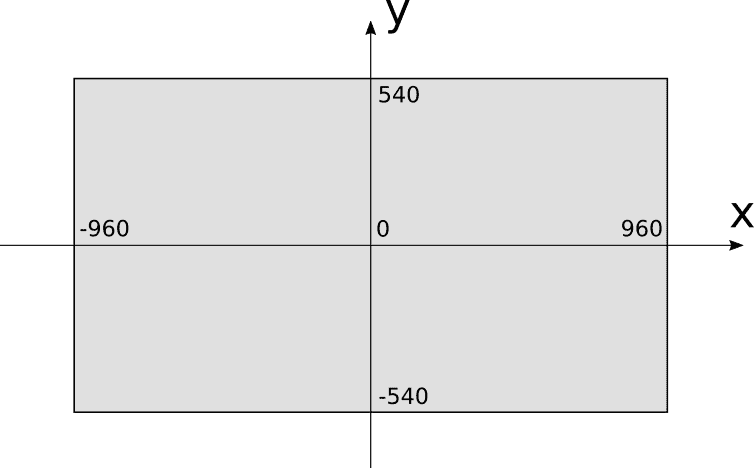
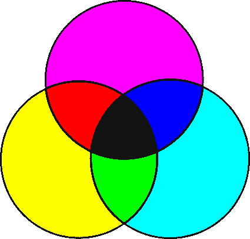
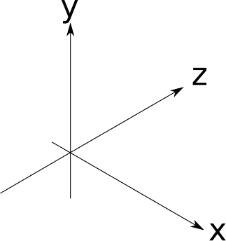

# 一、常用概念

> 原文:[https://gabrielgambetta . com/computer-graphics-from scratch/01-common-concepts . html](https://gabrielgambetta.com/computer-graphics-from-scratch/01-common-concepts.html)

光线跟踪器和光栅化器采用非常不同的方法将 3D 场景渲染到 2D 屏幕上。但是，这两种方法有一些共同的基本概念。

在这一章中，我们将探索画布，我们将在其上渲染图像的抽象表面；我们将用来引用画布上像素的坐标系；如何表现和操纵颜色；以及如何描述 3D 场景，以便我们的渲染器可以使用它。

## [画布](#the-canvas)

在整本书中，我们将在 *画布* 上绘制东西:一个可以单独着色的矩形像素阵列。这幅画布是显示在屏幕上还是打印在纸上与我们的目的无关。我们的目标是在 2D 画布上呈现一个 3D 场景，所以我们将专注于渲染这个抽象的矩形像素阵列。

我们将用一个非常简单的函数来构建本书中的所有内容，该函数为画布上的一个像素分配一种颜色:

```
<!DOCTYPE html>
<html>
<body>

<canvas id="myCanvas" width="200" height="100" style="border:1px solid #000000;">

</canvas>
<script>
    function PutPixel(context, x, y, color) {
	var roundedX = Math.round(x);
    var roundedY = Math.round(y);
    context.fillStyle = color || '#000000';
  	context.fillRect(roundedX, roundedY, 1, 1);
}


var canvas = document.querySelector('#myCanvas');
var context = canvas.getContext('2d');

PutPixel(context, 20, 10, '#aaf8a9'); // x=20 y=10 颜色
</script>
</body>
</html>
```
小小的更改了一下原著已经抛弃的函数，以后你们就要从这个`PutPixel`画点函数开始了。 （你们的痛苦才刚刚开始！） 
注：以后不再提供完整文件。  vscode go live 插件支持实时更改，以后写 WEBGL 你会回来感谢我的。  
这个方法有三个参数:一个`x`坐标、一个`y`坐标和一个颜色。现在让我们把注意力集中在坐标上。

### [坐标系](#coordinate-systems)

画布有宽度和高度，以像素为单位，我们称之为 $C_w$ 和 $C_h$。我们需要一个坐标系来表示它的像素。对于大多数电脑屏幕来说，原点在左上方； \(x\) 向屏幕右侧增大， \(y\) 向底部增大，如图 1-1 所示。
译者注：在由 DirectX 驱动的程序中原点位于左上角，在由 OpenGL 驱动的程序中原点位于左下角。


Figure 1-1: 大多数计算机屏幕使用的坐标系统。 由于图象存储器的组织方式，这种坐标系对计算机来说非常自然，但对人类来说不是最自然的。相反，3D 图形程序员倾向于使用通常用于在纸上绘制图形的坐标系:原点在中心， \(x\) 向右增加，向左减少，而 \(y\) 向上增加，向下减少，如图 1-2 所示。



Figure 1-2: 我们将用于画布的坐标系统。使用这个坐标系， \(x\) 坐标的范围是 $[{-C_w \over 2}]$ ，$(C_w \over 2)$ ， \(y\) 坐标的范围是 $[{-C_h \over 2}$，${C_h \over 2}]$ 。让我们假设对这些范围之外的坐标使用`PutPixel`函数没有任何作用。

在我们的例子中，画布将被绘制在屏幕上，所以我们需要从一个坐标系转换到另一个坐标系。为此，我们需要改变坐标系的中心，反转 \(Y\) 轴的方向。由此得出的转换公式为:

$[S_x = {C_w \over 2} + C_x]$

$[S_y = {C_h \over 2} - C_y]$

我们将假设`PutPixel`自动进行这种转换；从这一点开始，我们可以认为画布的坐标原点在中心， \(x\) 增加到右边， \(y\) 增加到屏幕的顶部。

再来看看`PutPixel`剩下的参数:颜色。

## [颜色模式](#color-models)

颜色如何工作的理论很吸引人，但这超出了本书的范围。以下是与我们相关的方面的简化版本。

当光线照射到我们的眼睛时，会刺激它们背部的感光细胞。这些会在我们的大脑中产生信号，这取决于入射光的波长。我们把这些大脑信号的主观体验称为 *颜色* 。

我们只能看到特定波长范围内的光，称为 *可见范围* 。波长和频率成反比:波撞击得越频繁，波峰之间的距离越小，波携带的能量越多。这就是为什么红外线(波长长于 740 纳米，对应频率低于 405 太赫兹[THz])无害，而紫外线(波长短于 380 纳米，对应频率高于 790 THz)会灼伤你的皮肤。

每一种可以想象的颜色都可以被描述为不同波长的组合。例如，“白色” 是所有波长的总和，而 “黑色” 是没有任何光。通过列出组成颜色的所有波长来描述颜色是不切实际的；幸运的是，几乎所有的颜色都可以用三种颜色的线性组合来描述，我们称之为原色。

### [减色模型](#subtractive-color-model)

减色模型是你在蹒跚学步时用蜡笔做的事情的一个有趣的名字。你拿一张白纸和红色、蓝色和黄色的蜡笔。你画一个黄色的圆，然后一个蓝色的圆重叠在上面，你就得到绿色！黄色和红色——橙色！红色和蓝色——紫色！将这三种物质混合在一起——黑色的东西！幼儿园是不是很神奇？图 1-3 显示了减色法的原色，以及混合后的颜色。


Figure 1-3: 减色法及其组合。物体有不同的颜色，因为它们吸收和反射光线的方式不同。让我们从白光开始，比如阳光(阳光不是很白，但对于我们的目的来说已经足够近了)。白光包含各种波长的光。当它击中一个物体时，物体的表面会吸收一些波长，并反射其他波长，这取决于材料。一些反射的光照射到我们的眼睛，我们的大脑将其转化为颜色。什么颜色？被表面反射的波长的总和。

蜡笔是怎么回事？你从纸上反射的白光开始。因为它是白纸，所以它反射大部分接收到的光线。当你用“黄色”蜡笔画画时，你添加了一层吸收某些波长但让其他波长通过的材料。它们被纸反射，再次穿过黄色层，击中你的眼睛，你的大脑将这种特定的波长组合解释为“黄色”黄色层所做的是 *从原始白光中减去* 一束波长。

你可以把每个彩色圆圈想象成一个过滤器:当你画一个蓝色圆圈与黄色圆圈重叠时，你会从原始光线中过滤掉更多的波长，所以映入你眼帘的是蓝色或黄色圆圈都没有过滤掉的波长，你的大脑将这些波长视为“绿色”

总之，我们从所有的波长开始，减去一些原色来创造任何其他的颜色。这种颜色模型得名于这样一个事实，即我们通过减去波长来创造颜色。

不过，这个模型并不完全正确。减色法模型中真正的原色不是教给幼儿和艺术学生的蓝色、红色和黄色，而是青色、品红色和黄色。此外，混合三原色会产生一种有点暗的颜色，不是很黑，所以纯黑色被添加为第四种“原色”因为 B 用来表示蓝色，黑色用 K 表示，所以我们得到了 *CMYK 颜色模型* (图 1-4)。

您可以在彩色打印机的墨盒上直接看到这种颜色模型的证据，或者有时在廉价印刷的传单上看到不同颜色之间略有差异的形状。



Figure 1-4: 打印机使用的四种减色法原色 
### [加色模型](#additive-color-model)

减色模型只是故事的一半。如果你曾经近距离或用放大镜看屏幕(或者，老实说，不小心在上面打了个喷嚏)，你可能会看到微小的彩色点:这些是红色、绿色和蓝色。

电脑屏幕是纸的对立面。纸不发光；它仅仅反射一部分射到它上面的光。另一方面，屏幕是黑色的，但它们会自己发光。对于纸张，我们从白光开始，*减去* 我们不想要的波长；有了屏幕，我们从没有光开始，*添加* 我们想要的波长。

为此需要不同的原色。大多数颜色可以通过向黑色表面添加不同量的红色、绿色和蓝色来创建；这是 *RGB 颜色模型*，一个 *加色模型* ，如图 1-5 所示。

加色原色的组合 *比其成分* 更亮，而减色原色的组合更暗；所有的加色原色加起来是白色，而所有的减色原色加起来是黑色。


Figure 1-5: 加色法和它们的组合
### [忘记细节](#forget-the-details)

现在你知道了所有这些，你可以有选择地忘记大部分细节，专注于对我们工作重要的事情。

大多数颜色可以用 RGB 或 CMYK(或许多其他颜色模型中的任何一种)来表示，并且可以从一个 *颜色空间* 转换到另一个颜色空间。因为我们的重点是在屏幕上渲染，所以在本书的其余部分我们使用 RGB 颜色模型。

如上所述，物体吸收一部分到达它们的光，并反射其余的光。哪些波长被吸收，哪些被反射，这就是我们所感知的表面“颜色”。从现在开始，我们将简单地把颜色当作一个表面的属性，忘记光的波长。

## [颜色位深和表现](#color-depth-and-representation)

显示器通过混合不同量的红色、绿色和蓝色来产生颜色。他们通过提供不同的电压，以不同的强度照亮表面上的彩色小点来做到这一点。

我们能得到多少种不同的强度？虽然电压是连续的，但我们将使用计算机来处理颜色，计算机使用离散值(也就是说，它们的数量有限)。我们能表现的红色、绿色和蓝色的色调越多，我们就能产生越多的颜色。

如今你看到的大多数图像每种原色使用 8 位，在本文中我们称之为 *颜色通道* 。使用 8 位每通道给我们 24 位每像素，总共 $(2^{24})$ 不同的颜色(大约 1670 万)。这种格式被称为 *R8G8B8* 或简称为 *888* ，我们将在本书中通篇使用。我们说这种格式有 24 位的 *色深* 。

这绝不是唯一可能的格式。不久前，为了节省内存，15 位和 16 位格式很流行，在 15 位的情况下，每个通道分配 5 位，在 16 位的情况下，红色分配 5 位，绿色分配 6 位，蓝色分配 5 位(称为 *R5G6B5* 或 *565* 格式)。绿色得到额外的一点，因为我们的眼睛对绿色的变化比对红色或蓝色的变化更敏感。(你猜猜为什么苹果手机的 coms 像素数少但拍的清楚)

用 16 位，我们得到 $(2^{16})$ 颜色(大约 65，000)。这意味着在 24 位模式下，每 256 种颜色对应一种颜色。虽然 65，000 种颜色已经足够了，但对于颜色变化非常缓慢的图像，您将能够看到非常细微的“台阶”，这在 1670 万种颜色中是看不到的，因为有足够的位数来表示中间的颜色。对于一些专门的应用程序，如电影的颜色分级，用每个通道更多的位来表示更多的颜色细节是一个好主意。

我们将使用 3 个字节来表示一种颜色，每个字节保存一个 8 位颜色通道的值，从 0 到 255。我们将颜色表示为 \((R，G，B)\)—例如， \((255，0，0)\) 代表纯红色； \((255，255，255)\) 代表白色；而 \((255，0，128)\) 代表一种红紫色。

## [颜色操作](#color-manipulation)

我们将使用一些操作来操纵颜色。如果你懂一些线性代数，你可以把颜色想象成 3D 颜色空间中的向量。如果没有，不要担心，我们将通过我们现在将使用的基本操作。

我们可以通过将每个颜色通道乘以一个常数来修改颜色的强度:

$k(r，g，B)$ = $(kR，kg，kb)$

例如， \((32，0，128)\) 的亮度是 \((16，0，64)\) 的两倍。

我们可以通过分别添加颜色通道来将两种颜色相加:

$[(R1，G1，B1)+(R2，G2，B2)=(R1+R2，G1+G2，B1+B2)]$

比如我们要把红色的 \((255，0，0)\) 和绿色的 \((0，255，0)\) 组合起来，按通道相加得到 \((255，255，0)\) ，就是黄色的。

这些操作可能会产生无效值；例如，将 \((192，64，32)\) 的强度加倍会产生一个超出我们颜色范围的 \(R\) 值。我们将把任何超过 255 的值视为 255，任何低于 0 的值视为 0；我们称之为*箝位* 到[0–255]范围的值。这或多或少相当于在现实生活中拍摄曝光不足或曝光过度的照片时发生的情况:你得到的要么是全黑，要么是全白。

这就是我们关于颜色和`PutPixel`的初级读本。在我们进入下一章之前，让我们花一点时间来探索如何表现我们将要渲染的 3D 物体。

## [场景](#the-scene)

到目前为止，我们已经介绍了画布，我们可以在其上给像素着色的抽象表面。现在我们通过引入另一个抽象将注意力转向我们感兴趣的对象:场景。

场景是您可能有兴趣渲染的一组对象。它可以代表任何东西，从漂浮在无限空间中的单个球体(我们将从那里开始)到脾气暴躁的食人魔鼻子内部的令人难以置信的详细模型。

我们需要一个坐标系来讨论场景中的物体。我们不能使用与画布相同的坐标系，原因有二。首先，画布是 2D，而场景是 3D 的。其次，画布和场景使用不同的单位:我们对画布使用像素，对场景使用真实世界的单位(比如英制或公制)。

轴的选择是任意的，所以我们将选择对我们的目的有用的东西。我们说 \(Y\) 向上， \(X\) 和 \(Z\) 水平，三个轴相互垂直。把平面 \(XZ\) 想象成“地板”，而 \(XY\) 和 \(YZ\) 则是方形房间里垂直的“墙壁”。这与我们为画布选择的坐标系一致，其中 \(Y\) 向上， \(X\) 水平。(虽然在大多数固定管线里并不是这样 吐槽！)  
图 1-6 显示了它的样子。



Figure 1-6: 我们将用于我们的场景的坐标系统。场景单位的选择有些随意；这要看你的场景代表了什么。如果你在建模一个茶杯，度量“1”可能意味着 1 英寸，或者如果你在建模太阳系，它可能意味着 1 个天文单位。只要我们始终如一地使用我们选择的单位，它们是什么并不重要，所以从现在开始我们可以放心地忽略它们。

## [总结](#summary)

在这一章中，我们已经介绍了 canvas，它是一个抽象概念，代表了一个我们可以在上面画画的矩形表面，以及一个我们可以在上面构建其他东西的方法:`PutPixel`。我们还选择了一个坐标系来引用画布上的像素，并描述了一种表示这些像素颜色的方法。最后，我们介绍了场景的概念，并选择了在场景中使用的坐标系。

已经完成了这些函数, 现在是时候在它们上面创建一个光栅追踪器和一个光栅化处理器了。