# 三、光线

> 原文:[https://gabrielgambetta . com/computer-graphics-from scratch/03-light . html](https://gabrielgambetta.com/computer-graphics-from-scratch/03-light.html)

我们将开始通过引入光线来增加场景渲染的“真实感”。光是一个庞大而复杂的话题，所以我们将给出一个足够好的简化模型。这个模型在很大程度上是受现实世界中灯光工作方式的启发，但它也做了一些自由处理，目的是使渲染的场景看起来更好。

我们将从一些简化的假设开始，这将使我们的生活更容易，然后我们将介绍三种类型的光源:点光源，平行光和环境光。我们将通过讨论这些光如何影响表面的外观来结束这一章，包括漫反射和镜面反射。

## [简化假设](#simplifying-assumptions)

让我们做几个假设，让事情变得简单一些。首先，我们声明所有的光都是白色的。这让我们可以用一个实数来描述任何光，这个实数叫做光的 T2 强度。模拟彩色灯光并不复杂(我们只是使用三个强度值，每个颜色通道一个，并计算所有颜色和照明通道的方式)，但我们将坚持白光以保持简单。

第二，我们将忽略大气。在现实生活中，灯光看起来越远越暗；这是因为空气中漂浮的颗粒在光线穿过它们时吸收了部分光线。虽然这在光线跟踪器中并不复杂，但我们会保持简单并忽略这个效果；在我们的场景中，距离不会降低灯光的亮度。

## [光源](#light-sources)

光必须来自某个地方。在本节中，我们将定义三种不同类型的光源。

### [点光源](#point-lights)

*点光源* 从三维空间中的一个固定点发出光线，称为它们的 *位置* 。它们向四面八方均匀发光；这就是为什么他们也被称为 *全向灯* 。因此，点光源完全由其位置和强度来描述。

灯泡是点光源的真实写照。虽然现实生活中的灯泡不会从一个点发光，也不是完全全向的，但这是一个非常精确的近似。

让我们将向量 $(\vec{L})$ 定义为从场景中的一点 \(P\) 到光线 \(Q\) 的方向。我们可以将这个称为 *光矢量* 的矢量计算为 \(Q - P\) 。请注意，由于 \(Q\) 是固定的，而 \(P\) 可以是场景中的任意点，因此 $(\vec{L})$ 对于场景中的每个点都是不同的，如图 3-1 所示。

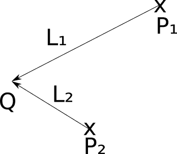

Figure 3-1: 在 *Q* 的一个点光源. $(\vec{\mathsf{L}})$ 向量在每个点 *P* 上都不同.### [方向灯](#directional-lights)

如果点光源是灯泡的一个很好的近似，那么它也是太阳的一个近似吗？

这是一个棘手的问题，答案取决于我们试图渲染什么。在太阳系的尺度上，太阳可以近似为一个点光源。毕竟它是从一个点发光，而且是向四面八方发光，所以看起来是合格的。

然而，如果我们的场景代表了地球上正在发生的事情，它就不是一个很好的近似。太阳离我们如此遥远，以至于到达我们这里的每一束光线几乎都有着完全相同的方向。我们可以用距离场景中的物体非常非常远的点光源来近似这个。然而，光和物体之间的距离会比物体之间的距离大几个数量级，所以我们会开始遇到数值精度误差。

为了更好地处理这些情况，我们定义了 *方向灯* 。与点光源一样，平行光也有强度，但与它们不同的是，它们没有位置；相反，他们有一个固定的 *方向* 。您可以将它们视为位于指定方向的无限远的点光源。

而在点光源的情况下，我们需要为场景中的每个点 \(P\) 计算不同的光矢量 $(\vec{L})$ ，在这种情况下，给出 \($ \vec{L} $\) 。在太阳对地球的场景示例中， \($ \vec{L} $\) 将是 *(太阳的中心)—(地球的中心)*。图 3-2 显示了它的样子。


Figure 3-2: 有方向的光. The \($ \vec{\mathsf{L}} $\)向量在每个点 *P* 上都相同.正如我们在这里看到的，对于场景中的每个点，平行光的光矢量都是相同的。与图 3-1 相比，在图 3-1 中，点光源的光矢量对于场景中的每个点都是不同的。

### [环境光](#ambient-light)

能否将每一个真实的灯光建模为点光源或平行光？差不多吧。这两种类型的光足够照亮一个场景吗？可惜没有。

想想月球会发生什么。附近唯一重要的光源是太阳。因此，月球相对于太阳的“前半部分”获得了所有的光线，而它的“后半部分”则处于完全的黑暗之中。我们从地球的不同角度看到这一点，创造了我们所说的月亮“相位”。

然而，地球上的情况有点不同。即使没有直接从光源接收光线的点也不是完全处于黑暗中(只要看看你椅子下面的地板)。如果光线对光源的“视野”被其他东西挡住了，光线是如何到达这些点的？

在[第一章(入门概念)](01-common-concepts.html)的“颜色模型”中提到，当光线照射到一个物体上时，它的一部分被吸收，但其余部分被散射回场景中。这意味着光不仅可以来自光源，还可以来自从光源获得光并将一部分光散射回场景的对象。但是为什么就此打住呢？散射光将依次撞击其他一些物体，一部分将被吸收，一部分将被散射回场景。依此类推，直到场景中的曲面吸收了原始光的所有能量。

这意味着我们应该把每一个物体视为一个光源。可以想象，这会给我们的模型增加很多复杂性，所以我们不会在本书中探究这种机制。如果你好奇，搜索*全球照明*，惊叹于这些美丽的图片。

但是我们仍然不希望每个物体要么被直接照亮，要么完全黑暗(除非我们实际上在渲染一个太阳系的模型)。为了克服这个限制，我们将定义第三种类型的光源，称为*环境光*，其特征仅在于其强度。我们将声明环境光为场景中的每个点贡献一些光，不管它在哪里。这是对场景中光源和表面之间非常复杂的相互作用的过度简化，但它工作得足够好。

通常，一个场景会有一个单独的环境光(因为环境光只有一个强度值，任何数量的环境光都可以合并成一个单独的环境光)和任意数量的点光和平行光。

## [单点照明](#illumination-of-a-single-point)

现在我们知道了如何定义场景中的灯光，我们需要弄清楚灯光如何与场景中的物体表面相互作用。

为了计算单个点的照度，我们将计算每个光源贡献的光量，并将它们加在一起，得到一个代表该点接收的光总量的单一数字。然后，我们可以将该点的表面颜色乘以这个量，得到代表它接收到多少光的颜色阴影。

那么，当一束光线，无论是来自平行光还是点光源，击中场景中某个物体的某个点时，会发生什么呢？

根据物体反射光线的方式，我们可以直观地将物体分为两大类:“无光泽”和“有光泽”的物体。由于我们周围的大多数物体都可以归类为无光，我们将首先关注这一组。

## [漫反射](#diffuse-reflection)

当一束光线照射到一个无光泽的物体上时，光线会在每个方向上均匀地散射回场景中，这个过程被称为*漫反射*；这就是为什么无光物体看起来是无光的。

为了验证这一点，看看你周围的一些粗糙的物体，比如一面墙。如果你相对于墙移动，它的颜色不会改变。也就是说，无论你从哪里看，你看到的物体反射的光都是一样的。

另一方面，反射的光量取决于光线和表面之间的角度。直观地说，这是因为光线携带的能量必须根据角度分布在更小或更大的区域，所以单位面积反射到场景的能量分别更高或更低，如图 3-3 所示。

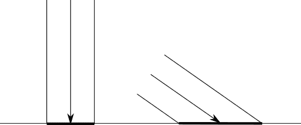

Figure 3-3: 光射线的能力分布在不同大小的区域中, 取决于它表面的角度.在图 3-3 中，我们可以看到两条强度相同(用宽度相同来表示)的光线以一定的角度迎面击中一个表面。光线携带的能量均匀地传播到它们照射的区域。右边光线的能量比左边光线的能量扩散到更大的区域，因此在它的区域中的每个点接收到的能量比左边的少。

为了从数学上探索这一点，让我们通过表面的 *法向量* 来表征表面的方向。曲面在点 \($ P $\) 处的法向量，或简称为“法线”，是垂直于曲面在 \($ P $\) 处的向量。它也是一个单位向量，意思是它的长度是 \($ 1 $\) 。我们将这个向量称为 \($ \vec{N} $\) 。

### [建模漫反射](#modeling-diffuse-reflection)

方向为 \($ \vec{L} $\) 、强度为 \($ I $\) 的光线以法线 \($ \vec{N} $\) 照射到表面上。作为 \($ I $\) 、 \($ \vec{N} $\) 、 \($ \vec{L} $\) 的函数， \($ I $\) 的哪一部分被反射回场景？

作为一个几何类比，让我们把光的强度表示为光线的“宽度”。它的能量扩散到一个大小为 \($ A $\) 的表面上。当 \($ \vec{N} $\) 和 \($ \vec{L} $\) 方向相同——光线垂直于表面时——则 \($ I = A $\) ，表示单位面积反射的能量与单位面积入射能量相同: \($ {I over A} = 1 $\) 。另一方面，当 \($ vec{L} $\) 与 \($ vec{N} $\) 之间的角度接近【\($ 90^\circ $\)】， \($ A $\) 接近 \($ infty $\) 时，单位面积的能量接近 0；\($ lim _ { A \ to \ infty } { I \over A } = 0 $\)。但是中间发生了什么呢？

这种情况如图 3-4 所示。我们知道 \($ vec{N} $\) 、 \($ vec{L} $\) 、\($ P $\)；我添加了角度 \($ alpha $\) 和 \($ beta $\) ，以及点 \($ Q $\) 、 \($ R $\) 和 \($ S $\) 以使图表的书写更加容易。

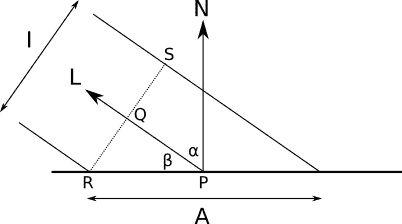

Figure 3-4: 这些向量和角度与弥漫反射计算有关。由于光线在技术上没有宽度，我们可以假设一切都发生在一个平坦的、无限小的表面上。即使它是一个球体的表面，我们正在考虑的面积是如此之小，以至于与球体的大小相比，它几乎是平的，就像地球在小尺度下看起来是平的。

宽度为 \($ I $\) 的光线以 \($ P $\) 的角度 \($ \beta $\) 打在表面上。 \($ P $\) 处的法线为 \($ \vec{N} $\) ，光线携带的能量遍布 \($ A $\) 。我们需要计算 \($ {I \over A} $\) 。

考虑 \($ RS $\) ，光线的“宽度”。根据定义，它垂直于 \($ \vec{L} $\) ，也是 \($ PQ $\) 的方向。因此， \($ PQ $\) 和 \($ QR $\) 形成一个直角，使得 \($ PQR $\) 成为一个直角三角形。

\($ PQR $\) 的一个角是【\($ 90^\circ\ $】，另一个是 \($ \beta\ $) 。因此剩下的角度就是\($ 90^\circ-\beta$\)。但是注意 \($ \vec{N} $\) 和 \($ PR $\) 也是直角，也就是说 \($\alpha + \beta $\) 也一定是 \($ 90^\circ $\) 。因此，\($\ wide hat { QRP } = \ alpha $\)。

让我们来关注一下三角形 \($PQR$\) (图 3-5)。它的角度是 \($\alpha$\) 、 \($\beta$\) 、【$90^\circ$】。边 \($QR$\) 测\($I\over2$\) ，边 \(PR\) 测\($A \over 2$\) 。

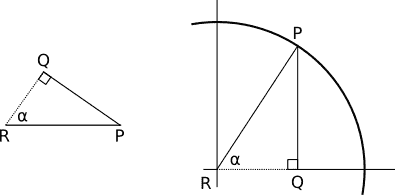

Figure 3-5: 现在，三角学来拯救我们！根据定义，\($cos(\ alpha)= { QR \over PR } $\)；将 \($QR$\) 替换为\($I \over 2$\) ，将 \($PR$\) 替换为\($A \over 2$\) ，我们得到

\[$cos(\ alpha)= { { I \over 2 } \over { A \over 2 } } $\]

这就变成了

\[$cos(\ alpha)= { I \over A }$\]

我们快到了。 \(\alpha\) 是 \(\vec{N}\) 与 \(\vec{L}\) 之间的角度。我们可以利用点积的性质(随意查阅线性代数附录)将 \(cos(\alpha)\) 表示为

\[$cos(\ alpha)= { \ lang \ vec { n }，\ vec { l } \ rangle } \over { | \ vec { n } | | \ vec { l } | } $\]

最后

\[${ I \over a } = { \ lang \ vec { n }，\ vec { l } \ rangle } \over { | \ vec { l } | }$\]

我们得出了一个简单的等式，它给出了反射光的比例，它是表面法线和光的方向之间的角度的函数。

注意，对于超过 \($90^\circ$\) 的角度， \($cos(\alpha)$\) 的值变为负值。如果我们盲目地使用这个值，我们最终会得到一个使表面*变暗的光源*！这没有任何物理意义；一个超过 \($90^\circ$\) 的角度仅仅意味着灯光实际上照亮了表面的 *背面*，因此它没有为我们正在照亮的点贡献任何光线。所以如果 \($cos(\alpha)$\) 变成负数，我们需要把它当成 \($0$\) 来对待。

### [漫反射方程](#the-diffuse-reflection-equation)

现在，我们可以制定一个等式来计算场景中的点 \($P$\) 与法线 \($\vec{N}$\) 所接收的全部光量，该场景具有强度为 \($I_A$\) 和 \($n$\) 的环境光，或者强度为 \($I_n$\) 和光矢量为 \($\vec{L_n}$\) 的平行光

\[$I _ p = I _ a+\ sum _ { I = 1 } ^ { n } I _ I { { \ lang \ vecn }，\ vec { l _ I } \ rangle } \over { | \vec { n } | }$\]

值得重复的是，不应将术语 \($\vec{N}$,$\vec{L_i}$ $rangle < 0$\) 添加到点的照明中。

### [球体法线](#sphere-normals)

只缺少一个小细节:法线从何而来？正如我们将在本书的第二部分看到的那样，这个一般性问题的答案远比看起来复杂。幸运的是，在这一点上我们只处理球体，对于它们有一个非常简单的答案:球体任意一点的法向量都位于通过球体中心的直线上。如图 3-6 所示，如果球心为 \($C$\) ，则 \($P$\) 点的法线方向为 \($P - C$\) 。

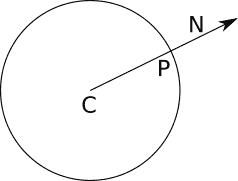

Figure 3-6:  *P* 处的球体和 *CP* 有一样的角度.为什么是“正常的方向”而不是“正常的”？法向量需要垂直于曲面，但也需要有长度 \($1$\) 。为了 *规格化* 这个向量并把它变成真正的法线，我们需要把它除以它自己的长度，从而保证结果有长度 \($1$\) : 

\[$\ vec { N } = { { P-C } \over { | P-C | } } $\]

### [漫反射渲染](#rendering-with-diffuse-reflection)

让我们把所有这些翻译成伪代码。首先，让我们给场景添加一些灯光:

```
light {
    type = ambient
    intensity = 0.2
}
light {
    type = point
    intensity = 0.6
    position = (2, 1, 0)
}
light {
    type = directional
    intensity = 0.2
    direction = (1, 4, 4)
}
```

注意，这些强度方便地加起来就是\($1.0$\)；由于照明等式的工作方式，这确保了任何点的光强都不能大于该值。这意味着我们不会有任何“过度曝光”的地方。

照明等式很容易翻译成伪代码(清单 3-1)。

```
ComputeLighting(P, N) {
    i = 0.0
    for light in scene.Lights {
        if light.type == ambient {
           ❶i += light.intensity
        } else {
            if light.type == point {
               ❷L = light.position - P
            } else {
               ❸L = light.direction
            }

            n_dot_l = dot(N, L)
           ❹if n_dot_l > 0 {
               ❺i += light.intensity * n_dot_l/(length(N) * length(L))
            }
        }
    }
    return i
}
```

Listing 3-1: 在漫反射中用于计算光源的函数。在清单 3-1 中，我们以稍微不同的方式对待三种类型的光。环境光是最简单的，直接由❶.处理点光源和平行光共享大部分代码，特别是强度计算❺，但是方向向量的计算方式不同(❷和❸)，这取决于它们的类型。正如我们之前讨论的，❹的条件确保我们不会添加负值，负值代表照亮表面背面的光。

剩下唯一要做的就是在`TraceRay`中使用`ComputeLighting`。我们替换返回球体颜色的线:

```
return closest_sphere.color
```

使用以下代码片段:

```
P = O + closest_t * D  // Compute intersection
N = P - closest_sphere.center  // Compute sphere normal at intersection
N = N / length(N)
return closest_sphere.color * ComputeLighting(P, N)
```

只是为了好玩，让我们添加一个黄色的大球体:

```
sphere {
    color = (255, 255, 0)  # Yellow
    center = (0, -5001, 0)
    radius = 5000
}
```

我们运行渲染器，你瞧，球体现在开始看起来像球体了(图 3-7)！

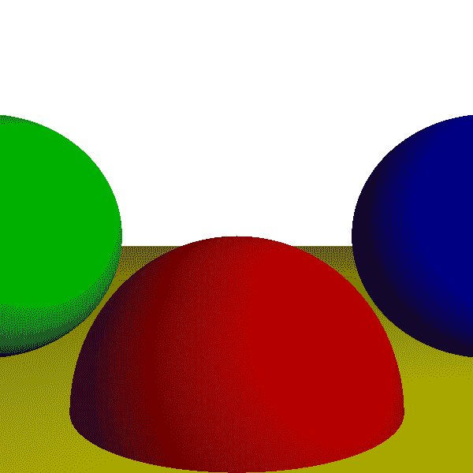

Figure 3-7: Diffuse reflection adds a sense of depth and volume to the scene.

[源代码和现场演示> >](https://gabrielgambetta.com/cgfs/diffuse-demo)

但是等等，那个黄色的大球体是怎么变成一个平整的黄色地板的？它没有；与其他三个球体相比，它是如此之大，而相机又离它如此之近，以至于它看起来是平的——就像我们站在地球上看起来是平的一样。

## [镜面反射](#specular-reflection)

让我们把注意力转向*闪亮的*物体。与无光对象不同，发光对象看起来略有不同，这取决于您从哪里看。

想象一个台球或者一辆刚从洗车场出来的汽车。这些种类的物体表现出非常特殊的光模式，通常是亮点，当你绕着它们移动时，它们似乎也在移动。与无光泽物体不同，你对这些物体表面的感知方式实际上取决于你的视角。

注意，如果你绕着一个红色的台球走，它会保持红色，但是当你绕着它走的时候，给它闪亮外表的亮白色斑点会移动。这表明我们想要建模的新效果并没有取代漫反射，而是对其进行了补充。

为了理解为什么会发生这种情况，让我们仔细看看表面是如何反射光线的。正如我们在上一节中看到的，当一束光线照射到无光物体的表面时，它会均匀地散射回场景的各个方向。这是因为物体的表面是不规则的，所以在微观层面上，它的行为就像一组指向随机方向的微小表面(图 3-8):

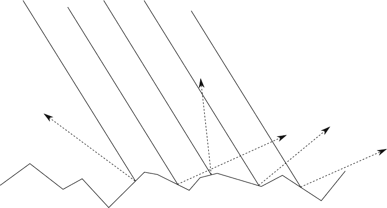

Figure 3-8: 用显微镜看铜片物体的粗糙表面像什么样子？光的射线被反射到不同的方向.但是如果表面不是那么不规则呢？让我们走向另一个极端:一面完美抛光的镜子。当一束光线射到镜子上时，它会向一个方向反射。如果我们称反射光的方向为 \($\vec{R}$\) ，并且我们保持惯例 \($\vec{L}$\) 指向光源，图 3-9 说明了这种情况。

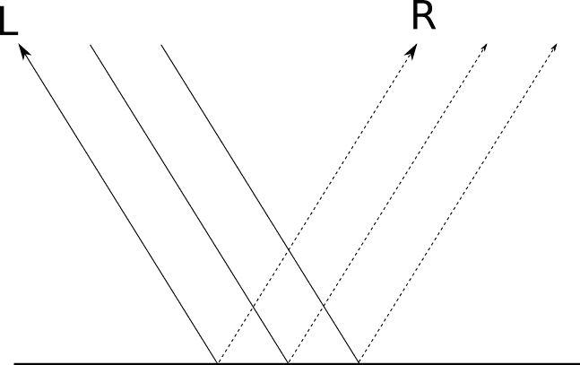

Figure 3-9: 镜子反射光的方向。根据表面的“抛光”程度，它或多或少像一面镜子；这就是为什么它被称为*镜面*反射，来自 *窥镜* ，拉丁语为 *镜子* 。

对于一面完美抛光的镜子，入射光线 \($\vec{L}$\) ， \($\vec{R}$\) 被单向反射。这就是为什么你能非常清楚地看到反射的物体:对于每一束入射光 \($\vec{L}$\) ，都有一束反射光 \($\vec{R}$\) 。但并不是每件物品都打磨得很完美；虽然 *大部分* 光被反射到 \($\vec{R}$\) ，*光的一部分*被反射到接近 \($\vec{R}$\) 的方向。越靠近 \($\vec{R}$\) ，该方向反射的光越多，如图 3-10 所示。物体的“亮度”决定了当你远离 \($\vec{R}$\) 时，反射光减弱的速度。

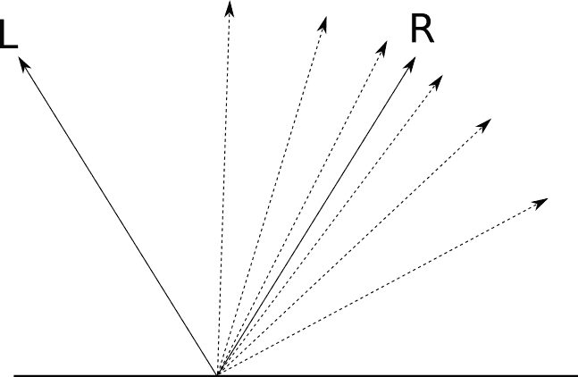

Figure 3-10: 对于那些没有绝对光滑的表面, 方向越接近\($\vec{\mathsf{R}}$\), 就越多的光线被反射到那个方向.我们想弄清楚有多少来自 \($\vec{L}$\) 的光被反射回我们的视点方向。如果 \($\vec{V}$\) 是从 \($P$\) 指向摄像机的“视图向量”，而 \($\alpha$\) 是 \($\vec{R}$\) 与 \($\vec{V}$\) 之间的角度，则得到图 3-11。


Figure 3-11: 镜子反射计算中的向量和角度。对于 \($\alpha = 0^\circ$\) ，所有光线都向 \($\vec{V}$\) 方向反射。对于 \($\alpha = 90^\circ$\) ，没有光被反射。与漫反射一样，我们需要一个数学表达式来确定中间值 \($\alpha$\) 会发生什么。

### [建模镜面反射](#modeling-specular-reflection)

在这一章的开始，我提到一些模型不是基于物理模型。这是其中之一。下面的模型是任意的，但是使用它是因为它易于计算并且看起来很好。

考虑 \($cos(\alpha)$\) 。它具有 \($cos(0) = 1$\) 和 \($cos(\pm 90) = 0$\) 的优良性质，正如我们所需要的；从 \($0$\) 到 \($90$\) 数值逐渐变小，曲线非常优美(图 3-12)。

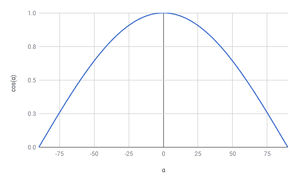

Figure 3-12: *$cos(\boldsymbol{\alpha})$*的图.这意味着 \($cos(\alpha)$\) 符合我们对镜面反射函数的所有要求，那么为什么不使用它呢？

还有一个细节。如果我们直接使用这个公式，每个物体都会同样闪亮。我们如何调整方程式来代表不同程度的光亮？

请记住，闪亮度是反射函数随着 \($\alpha$\) 的增加而降低的速度。获得不同闪亮度曲线的简单方法是计算 \($cos(\alpha)$\) 的某个正指数 \($s$\) 的幂。由于 \($0 \le cos(\alpha) \le 1$\) ，我们保证\($0 \ le cos(\alpha)^s \ le 1 $\)；所以 \($cos(\alpha)^s$\) 就跟 \($cos(\alpha)$\) 一样，只是“更窄”图 3-13 显示了 \($s$\) 不同值时【\($cos(\alpha)^s$】的曲线图。

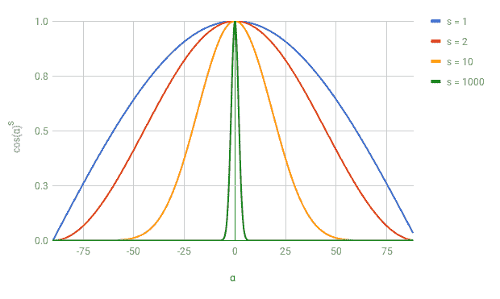

Figure 3-13: The graph of $cos(\boldsymbol{\alpha})$<sup>s</sup>\($s$\) 的值越大，函数在 \($0$\) 周围变得越“窄”，物体看起来越亮。 \($s$\) 称为 *镜面指数* ，是表面的一个属性。由于该模型不是基于物理现实，因此 \($s$\) 的值只能通过反复试验来确定——本质上，调整这些值直到它们看起来“正确”对于基于物理的模型，可以研究双向反射函数(BDRFs)。

让我们把这些放在一起。一束光线从方向 \($\vec{L}$\) 打在一个镜面指数 \($s$\) 的面上 \($P$\) 点处，其法线为 \($\vec{N}$\) 。有多少光线反射向观察方向 \($\vec{V}$\) 

根据我们的模型，这个值为 \($cos(\alpha)^s$\) ，其中 \($\alpha$\) 为 \($\vec{V}$\) 与 \($\vec{R}$\) 之间的夹角； \($\vec{R}$\) 依次是 \($\vec{L}$\) 相对于 \($\vec{N}$\) 的反映。所以第一步是从 \($\vec{N}$\) 和 \($\vec{L}$\) 计算 \($\vec{R}$\) 。

我们可以将 \($\vec{L}$\) 分解成两个向量， \($\vec{L_P}$\) 和 \($\vec{L_N}$\) ，使得\($\vec { L } = \ vec { L _ N }+\ vec { L _ P }$\)，其中 \($\vec{L_N}$\) 与平行.


Figure 3-14: 分解 \($\vec{\mathsf{L}}$\) 成为 \($\vec{\mathsf{L_P}}$\) 和 \($\vec{\mathsf{L_N}}$\)\($\vec{L_N}$\) 是 \($\vec{L}$\) 在 \($\vec{N}$\) 上的投影；根据点积的性质和 \($|\vec{N}| = 1$\) 的事实，这个投影的长度是\($\vec{N}$，$\vec{L}$ $\angle$\) 。我们定义 \($\vec{L_N}$\) 平行于 \($\vec{N}$\) ，所以\($\ vec { L _ N } = \vec{N}$ $\ vec { N }$，$\vec{L}$ $\angle$\) 。

从($\ vec { l _ p }+\ vec { l _ n }$)开始，我们可以立即得到($\ vec { l _ p } = \ vec { l _ n }-\ vec { l _ n } = \ vec$ $-\ vec { n }$)；$\ lang \ vec { n }，\ vec { l } \ row $})

现在我们来看看 \($\vec{R}$\) 。由于它相对于\($\ vec { L } $\)对称于\($\ vec { N } $\)，其平行于 \($\vec{N}$\) 的分量与 \($\vec{L}$\) 的分量相同，其垂直分量与 \($\vec{L}$\) 的分量相反；即\($\ vec { R } = \ vec { L _ N }-\ vec {L _P}$ \)。你可以在图 3-15 中看到这一点。


Figure 3-15: 计算 \($\vec{\mathsf{L_R}}$\)用上面找到的表达式替换，我们得到

[$\ vec { r } = \ vec { n } \ lang \ vec { n }、\vec{L}、\angle - \vec{L} + \vec{N}、\ lang le \ t1 $]

简化一点

\[$\ vec { r } = 2 \ vec { n } \ lang \ vec { n }、\vec{L}、\ rangle-\ vec { l }$]

### [镜面反射项](#the-specular-reflection-term)

我们现在准备写一个镜面反射的方程式:

\[$\ vec { r } = 2 \ vec { n } \ lang \ vec { n }、\vec{L}、\ rangle-\ vec { l }$]

\[$I _ s = I _ l \ left({ { \vec{R}，\ vec { v } \angle } \over { | \ vec { r } | | \ vec { v } | } } )^s $\]

和漫射照明一样， \($cos(\alpha)$\) 有可能是负的，我们应该像之前一样忽略它。还有，不是每个物体都必须是闪亮的；对于无光物体，镜面反射项根本不需要计算。我们将在场景中注意到这一点，将它们的镜面反射指数设置为 \($-1$\) ，并相应地处理它们。

### [全光照方程](#the-full-illumination-equation)

我们可以将镜面反射项添加到我们开发的照明方程中，并获得描述某一点的照明的单一表达式:

\[$I _ p = I _ a+\ sum _ { I = 1}^{n} I _ I \ cdot \ left[{ { { \vec{N}，\ vec { l _ I } \angle } \over { | \ vec { n } | \ vec { l _ I } | } }+\ left({ { \vec{R_i}，\ vec { v } \angle } \over { | \ vec { r _ I } | \ vec { v } | } })}$

其中 \($I_P$\) 为 \($P$\) 、 \($I_A$\) 为环境光强度、 \($N$\) 为 \($P$\) 、 \($V$\) 为 \($P$\) 到相机的向量、 \($s$) \($L_i$\) 是 P 到光 \($i$\) 的矢量， \($R_i$\) 是光 \($i$\) 在 \($P$\) 的反射矢量。

### [镜面反射渲染](#rendering-with-specular-reflections)

让我们添加镜面反射到目前为止我们一直在处理的场景中。首先，场景本身的一些变化:

```
sphere {
    center = (0, -1, 3)
    radius = 1
    color = (255, 0, 0)  # Red
    specular = 500  # Shiny
}
sphere {
    center = (2, 0, 4)
    radius = 1
    color = (0, 0, 255)  # Blue
    specular = 500  # Shiny
}
sphere {
    center = (-2, 0, 4)
    radius = 1
    color = (0, 255, 0)  # Green
    specular = 10  # Somewhat shiny
}
sphere {
    center = (0, -5001, 0)
    radius = 5000
    color = (255, 255, 0)  # Yellow
    specular = 1000  # Very shiny
}
```

这与之前的场景相同，只是在球体定义中增加了镜面反射指数。

在代码层面，我们需要在必要时更改`ComputeLighting`来计算镜面反射项，并将其添加到整体光线中。注意，这个函数现在需要 \($\vec{V}$\) 和 \($s$\) ，如清单 3-2 所示。

```
ComputeLighting(P, N, V, s) {
    i = 0.0
    for light in scene.Lights {
        if light.type == ambient {
            i += light.intensity
        } else {
            if light.type == point {
                L = light.position - P
            } else {
                L = light.direction
            }

            // Diffuse
            n_dot_l = dot(N, L)
            if n_dot_l > 0 {
                i += light.intensity * n_dot_l/(length(N) * length(L))
            }

            // Specular
         ❶ if s != -1 {
                R = 2 * N * dot(N, L) - L
                r_dot_v = dot(R, V)
             ❷ if r_dot_v > 0 {
                    i += light.intensity * pow(r_dot_v/(length(R) * length(V)), s)
                }
            }
        }
    }
    return i
}
```

Listing 3-2: `ComputeLighting` 支持漫反射和镜像反射。大部分代码保持不变，但是我们添加了一个片段来处理镜面反射。我们确保它只适用于有光泽的物体❶，也确保我们没有添加负光强度❷，因为我们做了漫反射。

最后，我们需要修改`TraceRay`来将新的参数传递给`Compute` `Lighting`。 \($s$\) 很简单:它直接来自场景定义。但是 \($\vec{V}$\) 从何而来？

\($\vec{V}$\) 是从物体指向相机的向量。幸运的是，我们已经有了一个从相机指向`TraceRay`处物体的向量，也就是 \($\vec{D}$\) ，我们正在追踪的光线的方向！所以 \($\vec{V}$\) 简单来说就是 \($\vec{D}$\) 。

清单 3-3 给出了带有镜面反射的新`TraceRay`。

```
TraceRay(O, D, t_min, t_max) {
    closest_t = inf
    closest_sphere = NULL
    for sphere in scene.Spheres {
        t1, t2 = IntersectRaySphere(O, D, sphere)
        if t1 in [t_min, t_max] and t1 < closest_t {
            closest_t = t1
            closest_sphere = sphere
        }
        if t2 in [t_min, t_max] and t2 < closest_t {
            closest_t = t2
            closest_sphere = sphere
        }
    }
    if closest_sphere == NULL {
        return BACKGROUND_COLOR
    }

    P = O + closest_t * D  // Compute intersection
    N = P - closest_sphere.center  // Compute sphere normal at intersection
    N = N / length(N)
 ❶ return closest_sphere.color * ComputeLighting(P, N, -D, closest_sphere.specular)
}
```

Listing 3-3: `TraceRay` with specular reflection颜色计算❶比它看起来稍微复杂一些。请记住，颜色必须按通道相乘，并且结果必须限制在通道的范围内(在我们的示例中为[0–255])。虽然在示例场景中，灯光强度总计为 1.0，但现在我们添加了镜面反射的贡献，这些值可能会超出该范围。

你可以在图 3-16 中看到所有这些矢量杂耍的回报。


Figure 3-16: 这个场景显示了包围着的，弥散的，镜子似的反射. 我们不仅仅感觉到深度和数量, 并且每个表面都有着微小的不同.

[源代码和现场演示> >](https://gabrielgambetta.com/cgfs/specular-demo)

请注意，在图 3-16 中，镜面反射指数为 500 的红色球体比镜面反射指数为 10 的绿色球体有更集中的亮点，这完全符合预期。蓝色球体的镜面反射指数也是 500，但没有可见的亮点。这只是图像裁剪方式和场景中灯光放置方式的结果；事实上，红色球体的左半部分也没有任何镜面反射。

## [总结](#summary)

在这一章中，我们采用了上一章开发的非常简单的光线跟踪器，并赋予它模拟灯光以及它们与场景中的对象交互的能力。

我们将灯光分为三种类型:点光源、平行光和环境光。我们探索了它们中的每一个是如何代表你在现实生活中可以找到的不同类型的光，以及如何在我们的场景定义中描述它们。

然后，我们将注意力转向场景中物体的表面，将它们分为两种类型:无光泽和有光泽。我们讨论了光线如何与它们相互作用，并开发了两个模型——漫反射和镜面反射——来计算它们向相机反射的光量。

最终结果是更加真实的场景渲染:我们现在看到的不是物体的轮廓，而是一种真实的深度和体积感，以及对构成物体的材料的感觉。

然而, 我们还没有介绍了光的基础: 阴影. 这是下一章的主题.