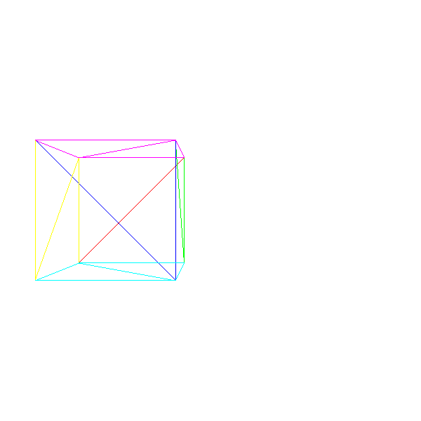
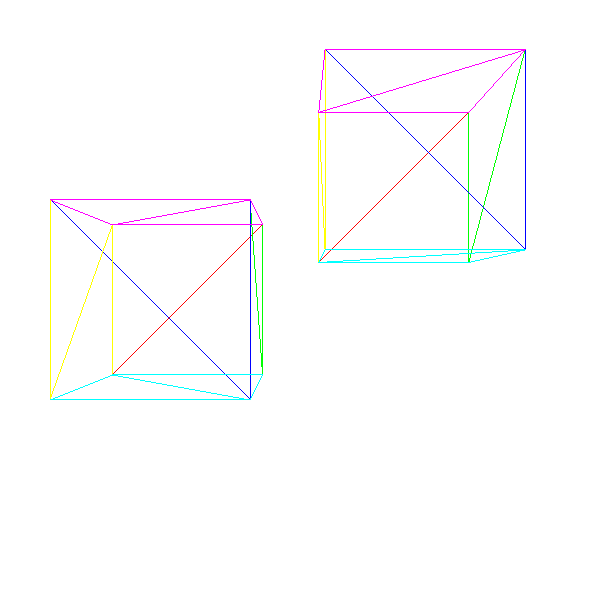
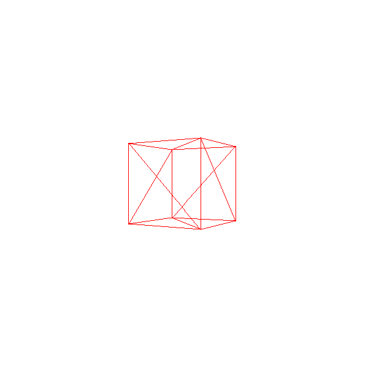
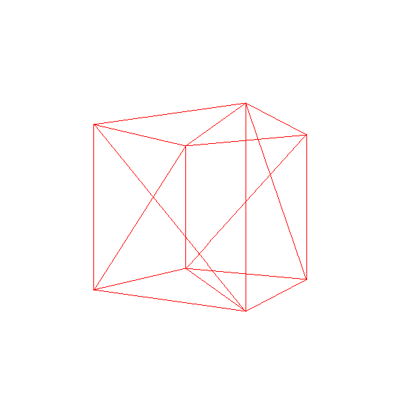
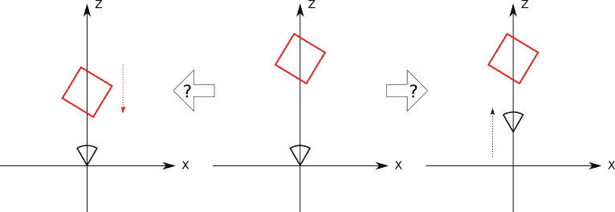
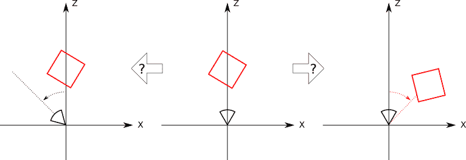
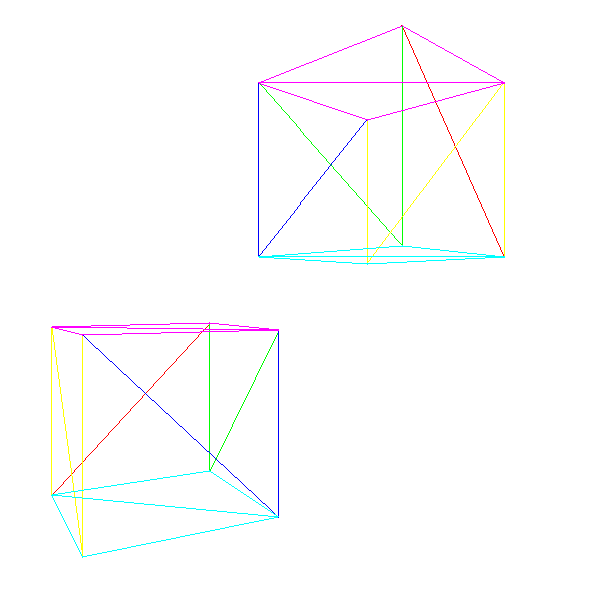

# 描述和渲染场景

> 原文:[https://gabrielgambetta . com/computer-graphics-from scratch/10-descripting-and-rendering-a-scene . html](https://gabrielgambetta.com/computer-graphics-from-scratch/10-describing-and-rendering-a-scene.html)

在过去的几章中，我们开发了算法，根据 2D 坐标在画布上绘制 2D 三角形，我们还探索了将场景中点的 3D 坐标转换为画布上点的 2D 坐标所需的数学运算。

在前一章的结尾，我们拼凑了一个程序，用这两者在 2D 画布上渲染一个 3D 立方体。在这一章中，我们将形式化并扩展这项工作，目标是渲染包含任意数量对象的整个场景。

## [代表一个立方体](#representing-a-cube)

让我们再次考虑如何表示和操作一个立方体，这次的目标是找到一个更通用的方法。我们的立方体的边长为 2 个单位，并且平行于坐标轴，它以原点为中心，如图 10-1 所示。


Figure 10-1: Our standard cube这些是其顶点的坐标:

立方体的边是正方形的，但我们开发的算法适用于三角形。我们首先选择三角形的原因之一是，任何其他多边形，包括正方形，都可以分解成三角形。因此，我们将使用两个三角形来表示立方体的每个正方形边。

然而，我们不能拿着立方体的任何三个顶点来描述它的表面上的一个三角形(例如，ADG 在立方体里面)。这意味着顶点坐标本身并不能完全描述立方体:我们还需要知道哪组三个顶点描述了组成其边的三角形。

以下是我们立方体中可能的三角形列表:

```
A, B, C
A, C, D
E, A, D
E, D, H
F, E, H
F, H, G
B, F, G
B, G, C
E, F, B
E, B, A
C, G, H
C, H, D
```

这暗示了一个通用结构，我们可以用它来表示任何由三角形组成的对象:一个`Vertices`列表，保存每个顶点的坐标；和一个`Triangles`列表，指定哪组三个顶点描述对象表面上的三角形。

除了组成它的顶点之外，`Triangles`列表中的每个条目可以包括附加信息；例如，这将是指定每个三角形颜色的最佳位置。

由于存储这些信息最自然的方式是在两个列表中，我们将使用列表索引来引用顶点列表中的顶点。所以我们的立方体可以这样表示:

```
Vertices
0 = ( 1,  1,  1)
1 = (-1,  1,  1)
2 = (-1, -1,  1)
3 = ( 1, -1,  1)
4 = ( 1,  1, -1)
5 = (-1,  1, -1)
6 = (-1, -1, -1)
7 = ( 1, -1, -1)

Triangles
 0 = 0, 1, 2, red
 1 = 0, 2, 3, red
 2 = 4, 0, 3, green
 3 = 4, 3, 7, green
 4 = 5, 4, 7, blue
 5 = 5, 7, 6, blue
 6 = 1, 5, 6, yellow
 7 = 1, 6, 2, yellow
 8 = 4, 5, 1, purple
 9 = 4, 1, 0, purple
10 = 2, 6, 7, cyan
11 = 2, 7, 3, cyan
```

用这种表示呈现一个对象非常简单:我们首先投影每个顶点，将它们存储在一个临时的投影顶点列表中(因为每个顶点平均使用四次，这避免了大量重复工作)；然后我们遍历三角形列表，呈现每个单独的三角形。第一个近似值如下所示:

```
RenderObject(vertices, triangles) {
    projected = []
    for V in vertices {
        projected.append(ProjectVertex(V))
    }
    for T in triangles {
        RenderTriangle(T, projected)
    }
}

RenderTriangle(triangle, projected) {
    DrawWireframeTriangle(projected[triangle.v[0]],
                          projected[triangle.v[1]],
                          projected[triangle.v[2]],
                          triangle.color)
}
```

Listing 10-1: An algorithm to render any object made of triangles我们可以将它直接应用到上面定义的立方体上，但是结果看起来不会很好。这是因为它的一些顶点在摄像机后面，正如我们在前一章中所讨论的，这是一个奇怪事情的配方。如果你看看顶点坐标和图 10-1，你会注意到坐标原点，我们相机的位置，在立方体的内部。

要解决这个问题，我们只需移动立方体。为此，我们需要将立方体的每个顶点向同一个方向移动。姑且称这个方向 \(\vec{T}\) ，为“平移”。我们将立方体向前平移 7 个单位，以确保它完全在相机前面。我们还会将它向左平移 1.5 个单位，使它看起来更有趣。由于“向前”是 \(\vec{Z_+}\) 的方向，“向左”是 \(\vec{X-}\) 的方向，所以平移向量简单来说就是

\[\ vec { t } = \ begin { pmamatrix }-1.5 \ \ 0 \ \ 7 \ end { pmamatrix }]

为了计算立方体中每个顶点 \(V\) 的平移版本 \(V\，' \) ，我们只需要给它加上平移向量:

\[V\，' = V + \vec{T}\]

在这一点上，我们可以得到立方体，平移每个顶点，然后应用清单 10-1 中的算法得到我们的第一个 3D 立方体(图 10-2)。



Figure 10-2: Our cube, translated in front of the camera, rendered with wireframe triangles

[源代码和现场演示> >](https://gabrielgambetta.com/cgfs/scene-demo)

## [模型和实例](#models-and-instances)

如果我们要渲染两个立方体呢？一种简单的方法是创建一组新的顶点和三角形来描述第二个立方体。这是可行的，但是会浪费很多内存。如果我们想要渲染一百万个立方体会怎么样？

更好的方法是根据*模型*和*实例*来考虑。模型是一组顶点和三角形，以通用的方式描述某个对象(想想“一个立方体有八个顶点和六个边”)。另一方面，一个模型的实例描述了该模型在场景中的具体出现(想想“在(0，0，5)有一个立方体”)。

我们如何在实践中应用这个想法？我们可以对场景中的每个独特的物体有一个单独的描述，然后通过指定它们的坐标来放置它的多个副本。非正式地说，这就像说，“这是一个立方体的样子，这里，这里和那里都有立方体。”

这是我们使用这种方法描述场景的粗略近似值:

```
model {
    name = cube
    vertices {
        ...
    }
    triangles {
        ...
    }
}

instance {
    model = cube
    position = (-1.5, 0, 7)
}

instance {
    model = cube
    position = (1.25, 2, 7.5)
}
```

为了呈现这一点，我们只需浏览实例列表；对于每个实例，我们复制模型的顶点，根据实例的位置平移它们，然后像以前一样渲染它们(清单 10-2):

```
RenderScene() {
    for I in scene.instances {
        RenderInstance(I);
    }
}

RenderInstance(instance) {
    projected = []
    model = instance.model
    for V in model.vertices {
        V' = V + instance.position
        projected.append(ProjectVertex(V'))
    }
    for T in model.triangles {
        RenderTriangle(T, projected)
    }
}
```

Listing 10-2: An algorithm to render a scene that can contain multiple instances of several objects, each in a different position如果我们想让它像预期的那样工作，模型上顶点的坐标应该在一个对对象“有意义”的坐标系中定义；我们将这个坐标系称为模型空间。例如，我们定义我们的立方体，使得它的中心是(0，0，0)；这意味着当我们说“位于(1，2，3)的立方体”时，我们指的是“以(1，2，3)为中心的立方体”

在将实例平移应用于模型空间中定义的顶点之后，变换后的顶点现在在场景的坐标系中表示；我们称这个坐标系为世界空间。

没有硬性的规则来定义模型空间；这取决于您的应用程序的需求。例如，如果您有一个人的模型，将坐标系的原点放在他们的脚上可能是明智的。

图 10-3 显示了一个简单的场景，有两个立方体的实例。



Figure 10-3: A scene with two instances of the same cube model, placed in different positions

[源代码和现场演示> >](https://gabrielgambetta.com/cgfs/instances-demo)

## [模型转换](#model-transform)

我们上面描述的场景定义没有给我们太多的灵活性。由于我们只能指定一个立方体的*位置*,我们可以实例化尽可能多的立方体，但是它们都面向同一个方向。一般来说，我们希望对实例有更多的控制:我们还希望指定它们的方向，可能还有它们的比例。

从概念上讲，我们可以用这三个元素定义一个*模型变换*:一个缩放因子，一个在模型空间中围绕原点的旋转，以及一个到场景中特定点的平移:

```
instance {
    model = cube
    transform {
        scale = 1.5
        rotation = <45 degrees around the Y axis>
        translation = (1, 2, 3)
    }
}
```

我们可以扩展清单 10-2 中的算法来适应新的转换。然而，我们*应用*转换的顺序很重要；特别是，翻译必须在最后完成。这是因为大多数时候我们希望在模型空间中围绕它们的原点旋转和缩放实例，所以我们需要在它们转换到世界空间之前这样做。

为了理解结果的不同，请看图 10-4，它显示了一个【\(45^\circ\】围绕原点的旋转，接着是一个沿 z 轴的平移。


Figure 10-4: Applying rotation and then translation图 10-5 显示了旋转前应用的平移


Figure 10-5: Applying translation and then rotation严格地说，给定一个旋转后跟着一个平移，我们可以找到一个平移后跟着一个旋转(也许不是围绕原点)达到同样的结果。然而，使用第一种形式来表达这种转换要自然得多。

我们可以编写一个支持缩放、旋转和位置的新版本的`RenderInstance`:

```
RenderInstance(instance) {
    projected = []
    model = instance.model
    for V in model.vertices {
        V' = ApplyTransform(V, instance.transform)
        projected.append(ProjectVertex(V'))
    }
    for T in model.triangles {
        RenderTriangle(T, projected)
    }
}
```

Listing 10-3: An algorithm to render a scene that can contain multiple instances of several objects, each with a different transform`ApplyTransform`方法如下所示:

```
ApplyTransform(vertex, transform) {
    scaled = Scale(vertex, transform.scale)
    rotated = Rotate(scaled, transform.rotation)
    translated = Translate(rotated, transform.translation)
    return translated
}
```

Listing 10-4: A function that applies transforms to a vertex in the correct order## [摄像机变换](#camera-transform)

前面几节探讨了如何在场景中的不同点定位模型实例。在本节中，我们将探索如何在场景中移动和旋转相机。

想象你是一个漂浮在一个完全空的坐标系中的照相机。突然，一个红色的立方体正好出现在你的面前(图 10-6)。



Figure 10-6: A red cube appears in front of the camera.一秒钟后，立方体向你移动 1 个单位(图 10-7)。



Figure 10-7: The red cube moves toward the camera . . . or does it?但是立方体真的向你移动了 1 个单位吗？还是向立方体移动了 1 个单位？因为根本没有参考点，坐标系也是不可见的，所以没有办法仅仅通过观察你所看到的来判断，因为立方体和摄像机的*相对*位置在两种情况下是相同的(图 10-8)。



Figure 10-8: Without the coordinate system, we can’t tell whether it was the object or the camera that moved.现在立方体围绕你顺时针旋转 \(45^\circ\) 。是吗？也许是你逆时针旋转了 \(45^\circ\) ？同样，没有办法判断(图 10-9)。



Figure 10-9: Without the coordinate system, we can’t tell whether it was the object or the camera that rotated.这个思维实验表明，在固定场景周围移动相机和在旋转和平移周围场景的同时保持相机固定没有区别！

这种明显以自我为中心的宇宙愿景的好处是，通过保持相机固定在原点，指向 \(\vec{Z_+}\) ，我们可以不加任何修改地使用上一章推导的投影方程。摄像机的坐标系称为*摄像机空间*。

让我们假设摄像机也有一个附加的变换，包括平移和旋转。为了从摄像机的角度渲染场景，我们需要对场景的每个顶点应用与相反的*变换:*

\[V _ { translated } = V _ { scene }-camera . translation \]\[V _ { cam \ _ space } = inverse(camera . rotation)\ cdot V _ { translated } \]\[V _ { projected } = perspective \ _ projection(V _ { cam \ _ space })\]

注意，我们用旋转矩阵来表示旋转。更多细节请参考附录[【ch:linear _ algebra _ Appendix】](#ch:linear_algebra_appendix)。

## [变换矩阵](#the-transform-matrix)

既然我们可以移动相机和场景周围的实例，让我们后退一步，考虑模型空间中的顶点 \(V_{model}\) 在投影到画布点 \((cx，cy)\) 之前发生的一切。

我们首先应用模型变换从模型空间到世界空间:

\[V _ { model \ _ scaled } = instance . scale \ cdot V _ { model } \]\[V _ { model \ _ rotated } = instance . rotation \ cdot V _ { model \ _ scaled } \]\[V _ { world } = V _ { model \ _ rotated }+instance . translation \]

然后我们应用相机变换从世界空间到相机空间:

\[V _ { translated } = V _ { world }-camera . translation \]\[V _ { camera } = inverse(camera . rotation)\ cdot V _ { translated } \]

接下来，我们应用透视方程来获得视口坐标:

\[V _ x = { { V _ { camera } x \ cdot d } \ over { V _ { camera } z } } \]\[V _ y = { { V _ { camera } y \ cdot d } \ over { V _ { camera } z } } \]

最后，我们将视口坐标映射到画布坐标:

\[c _ x = { { v _ x \ cdot c _ w } \ over { v _ w } } \]\[c _ y = { { v _ y \ cdot c _ h } \ over { v _ h } } \]

正如你所看到的，这需要大量的计算和每个顶点的大量中间值。如果我们能把所有这些都简化成更紧凑、更高效的形式，那不是很好吗？

让我们将变换表示为接受一个顶点并返回一个变换后的顶点的函数。设 \(C_T\) 、 \(C_R\) 为摄像机平移和旋转； \(I_R\) 、 \(I_S\) 、 \(I_T\) 实例旋转、缩放、平移； \(P\) 透视投影；以及 \(M\) 视口到画布的映射。如果 \(V\) 是原始顶点， \(V\，' \) 是画布上的点，我们可以将上面的所有方程表示成这样:

\[V\，' = m(p(c_r^{-1}(c_t^{-1}(i_t(i_r(i_s(v)))))))\]

理想情况下，我们希望有一个单独的转换 \(F\) 来完成一系列原始转换所做的事情，但是它有一个更简单的表达式:

【f = m \ cdot p \ cdot c ^ {-1 } \ cdot c _ t ^ {-1 } \ cdot I _ t \ cdot I _ r \ cdot I _ s \】【v \，= F(V)】的缩写

找到一种简单的方法来表示 \(F\) 并不容易。我们的主要障碍是我们用不同的方式表达每一个变换:我们把平移表达为一个点和一个向量的和，把旋转表达为一个矩阵和一个点的乘法，把缩放表达为一个实数和一个点的乘法，把透视投影表达为实数的乘法和除法。但是如果我们能以同样的方式表达所有的变换，如果这种方式有一种机制来组合变换，我们就能得到我们想要的简单变换。

## [齐次坐标](#homogeneous-coordinates)

考虑一下表达式 \(A = (1，2，3)\) 。 \(A\) 代表的是 3D 点还是 3D 矢量？如果我们不知道 \(A\) 使用的上下文，就无从得知。

但是我们再加第四个值，叫做 \(w\) ，把 \(A\) 标为点或者向量。若 \(w = 0\) ，则为向量；如果 \(w = 1\) ，就是一个点。于是点 \(A\) 被明确地表示为 \(A = (1，2，3，1)\) 而向量 \(\vec{A}\) 被表示为 \((1，2，3，0)\) 。

由于点和向量共享相同的表示，这些四分量坐标被称为*齐次坐标*。齐次坐标有更深更复杂的几何解释，但这超出了本书的范围；在这里，我们只是将它们作为一个方便的工具。

操作用齐次坐标表示的点和向量符合它们的几何解释。例如，减去两点产生一个矢量:

\[(8，4，2，1) - (3，2，1，1) = (5，2，1，0)\]

将两个向量相加产生另一个向量:

\[(0，0，1，0) + (1，0，0，0) = (1，0，1，0)\]

同理，很容易看出，点和矢量相加产生一个点，矢量乘以标量产生一个矢量，等等，正如我们所料。

那么除了 \(0\) 或 \(1\) 之外，具有 \(w\) 值的坐标代表什么呢？它们也代表点。事实上，3D 中的任何点在齐次坐标中都有无限多的表示。重要的是坐标和 \(w\) 值之间的*比*。例如， \((1，2，3，1)\) 和 \((2，4，6，2)\) 表示同一点，同样的还有 \((-3，-6，-9，-3)\) 。

在所有这些表象中，我们称带有 \(w = 1\) 的表象为齐次坐标中点的*正则表象*；将任何其他表示转换为其规范表示或笛卡尔坐标是很简单的:

\[\ begin { p matrix } x \ \ y \ \ z \ \ w \ end { p matrix } = \ begin { p matrix } x \ over w \ \[6pt]y \ over w \ \[6pt]z \ over w \ \[6pt]1 \ end { p matrix } \ right arrow \ begin { p matrix } x \ over w \ \[6pt]y \ over w \ \[6pt]z \ over w \ end { p matrix } \]

所以我们可以把笛卡尔坐标转换成齐次坐标，再转换回笛卡尔坐标。但是这如何帮助我们找到所有变换的单一表示呢？

### [齐次旋转矩阵](#homogeneous-rotation-matrix)

让我们从旋转矩阵开始。将笛卡尔坐标系中的\(3 \乘以 3\) 旋转矩阵转换成齐次坐标系中的\(4 \乘以 4\) 旋转矩阵是很简单的；由于该点的 \(w\) 坐标不应该改变，我们在右侧添加一列，在底部添加一行，用零填充它们，并在右下方的元素中放置一个 \(1\) 以保持 \(w\) 的值:

[\ begin { pmamatrix } a&b&c \ \ d&e&f \ \ g&h&I \ end { pmamatrix } \ CDO \ begin { pmamatrix } x \ \ y \ \ z \ end { pmamatrix } = \ begin { pmamatrix } x“\ \ y”\ z”\ end

### [齐次标度矩阵](#homogeneous-scale-matrix)

在齐次坐标中，缩放矩阵也是微不足道的，其构造方式与旋转矩阵相同:

\[\ begin { p matrix } S _ x&0&0 \ \ 0&S _ y&0 \ \ 0&0&S _ z \ end { p matrix } \ cdot \ begin { p matrix } x \ \ y \ \ z \ end { p matrix } = \ begin { p matrix } x \ cdot S _ x \ \ y \ cdot S _ y \ \ z \ cdot S _ z \ end { p matrix } \ right arrow \ begin { p matrix } S _ S y \ \ z \ \ 1 \ end { p matrix } = \ begin { p matrix } x \ cdot S _ x \ \ y \ cdot S _ y \ \ z \ cdot S _ z \ \ 1 \ end { p matrix } \]

### [齐次平移矩阵](#homogeneous-translation-matrix)

旋转和缩放矩阵很容易；它们已经表示为笛卡尔坐标中的矩阵乘法，我们只需添加一个 \(1\) 来保留 \(w\) 坐标。但是我们能对一个平移做什么呢，我们已经把它表达为笛卡尔坐标中的一个加法？

我们正在寻找一个\(4 \乘以 4\) 矩阵，使得

[\ begin { pmamatrix } t _ x \ \ t _ y \ \ t _ z \ \ 0 \ end { pmamatrix }+\ begin { pmamatrix } x \ \ y \ \ z \ \ 1 \ end { pmamatrix } = \ begin { pmamatrix } a&b&c&d \ \ e&f&g&h \ \ n

先把重点放在获取 \(x + T_x\) 上。这个值是矩阵的第一行与点相乘的结果，也就是说，

\[\ begin { pmamatrix } a&b&c&d \ end { pmamatrix } \ CDO \ begin { pmamatrix } x \ \ y \ \ z \ \ 1 \ end { pmamatrix } = x+t _ x \]

如果我们展开向量乘法，我们得到

\[Ax + By + Cz + D = x + T_x\]

从这里我们可以推导出 \(A = 1\) 、 \(B = C = 0\) 、 \(D = T_x\) 。

按照对其余坐标的类似推理，我们得到用于平移的以下矩阵表达式:

[\ begin { pmamatrix } t _ x \ \ t _ y \ \ t _ z \ \ 0 \ end { pmamatrix }+\ begin { pmamatrix } x \ \ y \ \ z \ \ 1 \ end { pmamatrix } = \ begin { pmamatrix } 1]&0&0&t _ x \ \ 0&1&0&

### [齐次投影矩阵](#homogeneous-projection-matrix)

和与乘很容易表达为矩阵和向量的乘，因为它们毕竟涉及到和与乘。但是透视投影方程有一个除以 \(z\) 的除法。我们该如何表达呢？

你可能会忍不住认为除以 \(z\) 和乘以 \(1/z\) 是一样的，你可能想把 \(1/z\) 放到矩阵里来解决这个问题。但是，*我们会把哪个* \(z\) 坐标放在那里呢？我们希望这个投影矩阵为每个输入点的*工作，所以硬编码任何*点的 \(z\) 坐标不会给我们想要的。

幸运的是，齐次坐标确实有一个除法实例:当转换回笛卡尔坐标时，除以 \(w\) 坐标。如果我们能设法使原始点的 \(z\) 坐标显示为“投影”点的 \(w\) 坐标，一旦我们将该点转换回笛卡尔坐标，我们将得到投影的 \(x\) 和 \(y\) :

[\ begin { pmatrix } a&b&c&d \ \ e&f&g&h \ \ I&j&k&l \ end { pmatrix } \ CDO \ begin { pmatrix }

注意这个矩阵是\(3 \乘以 4 \)；它可以乘以一个四元素向量(齐次坐标中的转换后的 3D 点)，并将产生一个三元素向量(齐次坐标中的投影 2D 点)，然后通过除以 \(w\) 将其转换为 2D 笛卡尔坐标。这给了我们想要的值 \(x'\) 和 \(y'\) 。这里缺少的元素是 \(z'\) ，我们知道定义上等于 \(d\) 。

应用我们用来推导平移矩阵的相同推理，我们可以如下表达透视投影:

[\ begin { pmatrix } d&0&0&0 \ \ 0&d&0&0 \ \ 0&0&1&0 \ end { pmatrix } \ CDO \ begin { pmatrix }

### [同质视口到画布矩阵](#homogeneous-viewport-to-canvas-matrix)

最后一步是将视口中的投影点映射到画布上。这只是一个用 \(S_x = {c_w \over v_w}\) 、 \(S_y = {c_h \over v_h}\) 的 2D 缩放变换。因此，这个矩阵是

\[\ begin { p matrix } c _ w \ over v _ w&0&0 \ \ 0&c _ h \ over v _ h&0 \ \ 0&0&1 \ end { p matrix } \ cdot \ begin { p matrix } x \ \ y \ \ z \ end { p matrix } = \ begin { p matrix } x \ cdot c _ w \ over v _ w \ \[6pt]y \ cdot c _ h \ over v _ h \ \[6pt]

事实上，很容易将它与投影矩阵结合起来，得到一个简单的 3D 到画布矩阵:

\[\ begin { p matrix } d \ cdot CW \ over VW&0&0&0 \ \ 0&d \ cdot ch \ over VH&0&0 \ \ 0&0&1&0 \ end { p matrix } \ cdot \ begin { p matrix } x \ \ y \ \ z \ \ 1 \ end { p matrix } = \ begin { p matrix } x \ cdot d \ cdot CW \ over VW \ \[n

## [变换矩阵重访](#the-transform-matrix-revisited)

完成所有这些工作后，我们可以将我们需要将一个模型顶点 \(V\) 转换为画布像素 \(V\，' \) 的每一个变换表示为一个矩阵。此外，我们可以通过乘以相应的矩阵来组合这些变换。因此，我们可以将整个变换序列表示为一个矩阵:

【f = m \ cdot p \ cdot c ^-1 } \ cdot c _ t ^ {-1 } \ cdot I _ t \ cdot I _ r \ cdot I _ s \】

现在变换一个顶点只是计算下面的矩阵逐点乘法:

\[V\，' = F \cdot V\]

此外，我们可以将转换分解为三个部分:

\[m _ { projection } = m \ cdot p \]\[m _ { camera } = c_r^{-1} \ cdot c_t^{-1}\]\[m _ { model } = I _ t \ cdot I _ r \ cdot I _ s \]\[m = m _ { projection } \ cdot m _ { camera } \ cdot m _ { model } \]

这些矩阵不需要为每个顶点从头开始计算(这毕竟是使用矩阵的目的)。因为矩阵乘法是结合律，所以我们可以重用表达式中不变的部分。

\(M_{Projection}\) 应该很少变化；它只取决于视口的大小和画布的大小。例如，当应用程序从窗口切换到全屏时，画布的大小会发生变化。只有当摄像机的视野改变时，视口的尺寸才会改变；这种情况不常发生。

\(M_{Camera}\) 可能每一帧都变；这取决于摄像机的位置和方向，所以如果摄像机在移动或转动，就需要重新计算。但是，一旦计算出来，它对于在帧中绘制的每个对象都保持不变，所以每帧最多计算一次。

\(M_{Model}\) 对于场景中的每个实例都是不同的；但是，对于不移动的实例(例如，树和建筑物)，它将随时间保持不变，因此它可以计算一次并存储在场景本身中。对于移动的物体(例如，赛车游戏中的汽车)，需要在每次移动时进行计算(很可能是每一帧)。

一个非常高级的场景渲染伪代码如清单 10-5 所示。

```
RenderModel(model, transform) {
    projected = []
    for V in model.vertices {
        projected.append(ProjectVertex(transform * V))
    }
    for T in model.triangles {
        RenderTriangle(T, projected)
    }
}

RenderScene() {
    M_camera = MakeCameraMatrix(camera.position, camera.orientation)

    for I in scene.instances {
        M = M_camera * I.transform
        RenderModel(I.model, M)
    }
}
```

Listing 10-5: An algorithm to render a scene using transform matrices我们现在可以绘制一个包含不同模型的几个实例的场景，可能会四处移动和旋转，并且我们可以在整个场景中移动相机。图 10-10 显示了我们的立方体模型的两个实例，每个都有不同的变换(包括平移和旋转)，从一个平移和旋转的相机渲染。



Figure 10-10: A scene with two instances of the same cube model, having different instance transforms, and a transformed camera

[源代码和现场演示> >](https://gabrielgambetta.com/cgfs/transforms-demo)

## [总结](#summary)

我们在这一章中涉及了很多内容。我们首先探索了如何表示由三角形组成的模型。然后我们想出了如何将我们在前一章中得到的透视投影方程应用于整个模型，这样我们就可以从一个抽象的 3D 模型到它在屏幕上的表示。

接下来，我们开发了一种方法，在场景中拥有同一个模型的多个实例，而没有模型本身的多个副本。然后我们发现了如何解除我们迄今为止一直在处理的一个限制:我们的相机不再需要固定在坐标系的原点或指向 \(\vec{Z+}\) 。

最后，我们探索了如何将我们需要应用到顶点的所有变换表示为齐次坐标中的矩阵乘法，这使我们能够通过将许多连续的变换压缩到三个矩阵中来减少渲染场景所需的计算:一个用于透视投影和视口到画布的映射，一个用于实例变换，一个用于相机变换。

这给了我们很大的灵活性，我们可以在场景中表现什么，它也允许我们在场景中移动相机。但是我们仍然有两个重要的限制。首先，移动相机意味着我们可能会在它后面看到物体，这导致了各种各样的问题。第二，渲染看起来不是很好:它仍然是一个线框图像。

请注意，出于实际原因，我们不会在本书的其余部分使用完整的投影矩阵。相反，我们将分别使用模型和相机变换，然后将其结果转换回笛卡尔坐标，如下所示:

\[x ' = { x \ cdot d \ cdot CW \ over z \ cdot VW } \]

【y ' = { y \ CDO d \ CDO ch \ over z \ CDO VH }]

这让我们可以在投影点之前，在 3D 中做一些不能用矩阵变换来表达的操作。

In the next chapter, we’ll deal with objects that shouldn’t be visible, and then we’ll spend the rest of this book making the rendered objects look better.