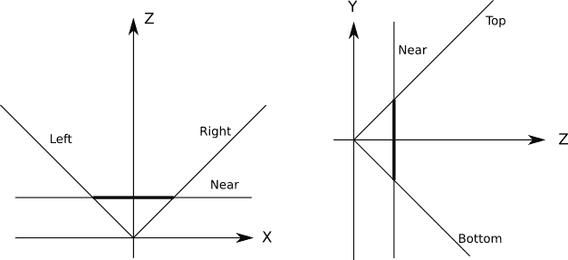
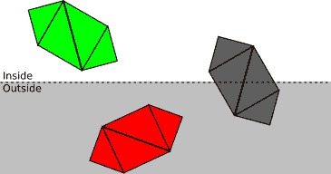
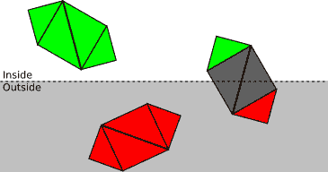
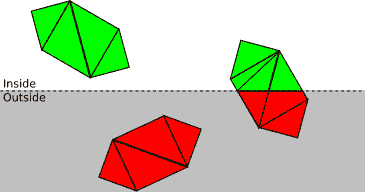
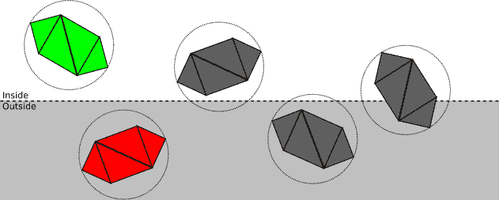
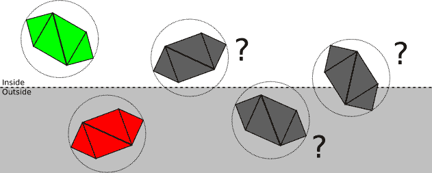
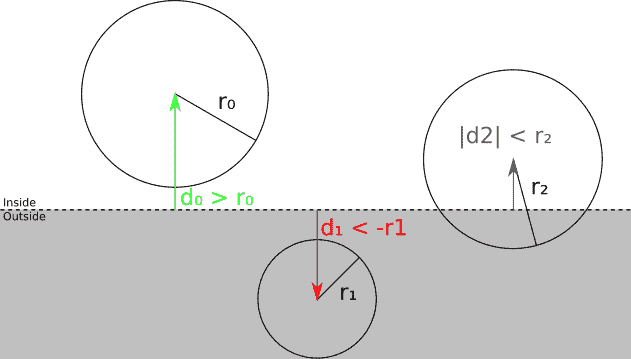
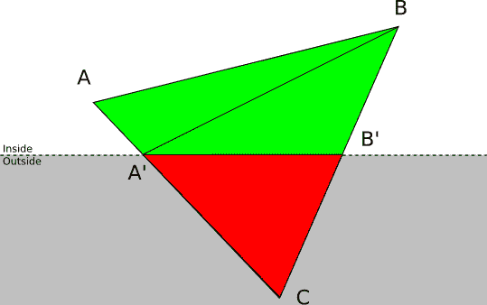

# 剪报

> 原文:[https://gabrielgambetta . com/computer-graphics-from scratch/11-clipping . html](https://gabrielgambetta.com/computer-graphics-from-scratch/11-clipping.html)

在最后几章中，我们开发了将场景的 3D 定义转换成我们可以在画布上绘制的 2D 形状的方程和算法；我们开发了一个场景结构，允许我们定义 3D 模型，并将这些模型的实例放在场景中；我们开发了一种算法，可以让我们从任何角度渲染场景。

然而，这样做暴露了我们一直在处理的一个限制:透视投影方程只对相机前面的点起预期的作用。由于我们现在可以围绕场景移动和旋转相机，这就产生了一个问题。

在这一章中，我们将开发必要的技术来解除这一限制:我们将探索如何识别相机后面的点、三角形和整个对象，并开发处理它们的技术。

## [剪辑过程概述](#an-overview-of-the-clipping-process)

回到[第九章(透视投影)](09-perspective-projection.html)，我们得出了以下等式:

\[P\，' _x = {P_x \cdot d \over P_z}\]

\[P\，' _y = {P_y \cdot d \over P_z}\]

被 \(P_z\) 除是有问题的；它会导致被零除。此外，相机后面的点具有负的 \(Z\) 值，这是我们目前无法正确处理的。即使是在相机前面但离它很近的点也会以严重扭曲的物体的形式造成麻烦。

为了避免这些有问题的情况，我们将选择不渲染投影平面 \(Z = d\) 后面的任何东西。这个*裁剪平面*让我们将任何点分类为*裁剪体积*内内的*或*外的*——也就是说，从摄像机实际可见的空间子集。在这种情况下，剪辑音量是“任何在 \(Z = d\) 前面的东西。”我们将只渲染场景中剪辑体积内的部分。*

## [剪辑音量](#the-clipping-volume)

使用单个裁剪平面来确保相机后面没有对象被渲染会产生正确的结果，但这并不完全有效。一些物体可能在照相机前面，但是仍然不可见；例如，一个物体在投影平面附近，但是在右边很远很远的地方的投影会被投影到视口之外，因此看不见，如图 11-1 所示。


Figure 11-1: An object that is in front of the projection plane,but will be projected outside of the viewport我们用来投影这样一个物体的任何计算资源，加上渲染它所做的每三角形和每顶点的计算，都将被浪费。完全忽略这些对象会更有效。

为了做到这一点，我们可以定义额外的平面来裁剪场景到*恰好*应该在视口中可见的地方；这些平面由摄像机和视口的四个边定义(图 11-2)。



Figure 11-2: The five planes that define our clipping volume每个裁剪平面将空间分成两部分，我们称之为半空间。“内部”半空间是飞机前方的一切；“外面”的半空间是它后面的一切。我们定义的裁剪体积的“内部”是由每个裁剪平面定义的“内部”半空间的*交集*。在这种情况下，剪裁体积看起来像一个顶部被切掉的无限高的金字塔。

这意味着，要针对裁剪体积裁剪场景，我们只需针对定义裁剪体积的每个平面连续裁剪场景。在对一个平面进行剪裁后，保留在内部的任何几何图形都会对其余平面进行剪裁。对所有平面裁剪场景后，剩余的几何体是对裁剪体积裁剪场景的结果。

接下来，我们将看看如何针对每个裁剪平面裁剪场景。

## [将场景裁剪在一个平面上](#clipping-the-scene-against-a-plane)

考虑一个有多个物体的场景，每个物体由四个三角形组成(图 11-3)。


Figure 11-3: A scene with three objects我们执行的操作越少，我们的渲染器就越快。我们将根据一个裁剪平面来裁剪场景，作为一系列的阶段。每个阶段将尝试对尽可能多的几何图形进行分类，这些几何图形是被*接受的*还是被*丢弃的*，这取决于它是在裁剪平面所定义的半空间之内还是之外(即该平面的裁剪体积)。任何不能被分类的几何图形都将进入下一阶段，这一阶段将对其进行更详细的研究。

第一阶段试图一次对整个对象进行分类。如果一个对象完全在裁剪体积内，它被接受(图 11-4 中的绿色)；如果完全在外面，则丢弃(图 11-4 红色)。



Figure 11-4: Clipping at the object level. Green is accepted, red is discarded, and gray requires further processing.如果一个对象不能被完全接受或丢弃，我们就进入下一个阶段，对它的每个三角形分别进行分类。如果一个三角形完全在裁剪体积内，它被接受；如果完全在外面，就丢弃了(见图 11-5)。



Figure 11-5: Clipping at the triangle level. Each triangle of the rightmost object is either accepted, discarded, or requires further processing.最后，对于每个既不被接受也不被丢弃的三角形，我们需要裁剪三角形本身。原来的三角形被删除，一个或两个新的三角形被添加以覆盖在裁剪体积内的三角形部分(见图 11-6)。



Figure 11-6: Clipping at the vertex level. Each triangle that is partially inside the clipping volume is split into one or two triangles that are fully inside the clipping volume.现在我们对裁剪的工作原理有了清晰的概念理解，我们将开发数学和算法来创建一个有效的实现。

## [定义裁剪平面](#defining-the-clipping-planes)

让我们从投影平面的方程 \(Z = d\) 开始，我们将使用它作为一个裁剪平面。这个等式很容易形象化，但对于我们的目的来说，它不是最方便或最通用的形式。

一个 3D 平面的一般方程是 \(Ax + By + Cz + D = 0\) ，意思是一个点 \(P = (x，y，z)\) 将满足那个方程当且仅当 \(P\) 在平面上。如果我们将系数 \((A，B，C)\) 分组在一个向量 \(\vec{N}\) 中，我们可以将方程改写为\(\乐浪\vec{N}，P \rangle + D = 0\) 。

注意，如果\(\乐浪\vec{N}，P \rangle + D = 0\) ，则\(k \乐浪\vec{N}，P \rangle + kD = 0\) 为 \(k\) 的任意值。具体来说，我们可以选择 \(k = {1 / |\vec{N}|}\) ，将原方程相乘，得到新方程\(\乐浪\vec{N}\，'，P \rangle + D\，' = 0\) 其中 \(\vec{N}\，' \) 为单位向量。所以任何给定的平面都可以用方程\(\乐浪\vec{N}，P \rangle + D = 0\) 来表示，其中 \(\vec{N}\) 是单位向量， \(D\) 是实数。

这是一个非常方便的表述: \(\vec{N}\) 恰好是平面的法线， \(-D\) 是从原点到平面的*符号距离*。其实对于任意一点 \(P\) ，\(\乐浪\vec{N}，P \rangle + D\) 是平面到 \(P\) 的带符号距离； \(distance = 0\) 只是 \(P\) 包含在平面中的特例。

如果 \(\vec{N}\) 是平面的法线，那么 \(\vec{-N}\) 也是平面的法线，所以我们选择 \(\vec{N}\) 使其指向裁剪体积的“内部”。对于平面 \(Z = d\) ，我们选择法线 \((0，0，1)\) ，它相对于相机指向“前方”。由于点 \((0，0，d)\) 包含在平面中，所以一定满足平面方程，我们可以求解为 \(D\) :

\[\langle \vec{N}，p \ rangle+d = \ lang(0，0，1)，(0，0，d) \rangle + D = d + D = 0\]

并且由此我们立刻得到 \(D = -d\) 。

我们本来可以把原来的平面方程 \(Z = d\) 改写成 \(Z - d = 0\) ，直接得到 \(D = -d\) 。然而，我们可以应用这种通用方法来推导其余裁剪平面的方程。

我们知道所有这些额外的平面都有 \(D = 0\) (因为它们都经过原点)，所以我们需要做的就是确定它们的法线。为了使数学简单，我们将选择一个 \(90^\circ\) 视野(FOV)，这意味着平面在 \(45^\circ\) 。

考虑左侧剪裁平面。其法线方向为 \((1，0，1)\) (即【\(45^\circ\】向右前方)。向量的长度是 \(\sqrt{2}\) ，所以如果我们对它进行归一化，我们得到 \(({1 \over \sqrt{2}}，0，{1 \over \sqrt{2}})\) 。因此，左裁剪平面的方程式为

\[\乐浪 N，P \ rangle+D = \乐浪({1 \over \sqrt{2}}，0，{1 \over \sqrt{2}})，P \rangle = 0\]

同样，右侧、底部和顶部剪裁平面的法线是 \(({-1 \over \sqrt{2}}，0，{1 \over \sqrt{2}})\) 、 \((0，{1 \over \sqrt{2}}，{1 \over \sqrt{2}})\) 和 \((0，{-1 \over \sqrt{2}}，{1 \over \sqrt{2}))计算任意 FOV 的裁剪平面只需要一点点三角学。

总之，我们的裁剪体积由以下五个平面定义:

\[(near)\乐浪(0，0，1)，P \ rangle-d = 0 \]\[(left)\乐浪({1 \over \sqrt{2}}，0，{1 \over \sqrt{2}})，P \ rangle = 0 \]\[(right)\乐浪({-1 \over \sqrt{2}}，0，{1 \over \sqrt{2}})，P \rangle = 0\]

现在让我们来详细看看如何在平面上裁剪几何图形。

## [裁剪整个对象](#clipping-whole-objects)

假设我们把每个模型放在能容纳它的最小球体里面；我们称这个球为物体的*包围球*。计算这个球体比看起来要困难得多，这超出了本书的范围。但是可以通过以下方法获得粗略的近似值:首先通过平均模型中所有顶点的坐标来计算球体的中心，然后将半径定义为从中心到最远顶点的距离。

在任何情况下，让我们假设我们知道完全包含每个模型的球体的中心 \(C\) 和半径 \(r\) 。图 11-7 显示了一个有几个物体和它们的包围球的场景。


Figure 11-7: A scene with a few objects and their bounding spheres我们可以将这个球体和一个平面之间的空间关系分类如下:

The sphere is completely in front of the plane.

在这种情况下，整个对象都被接受；无需对此平面进行进一步的裁剪(但它仍可能被不同的平面裁剪)。例子见图 11-8。


Figure 11-8: The green object is accepted.The sphere is completely behind the plane.

在这种情况下，整个对象被丢弃；无需进一步裁剪(无论其他平面是什么，对象的任何部分都不会在裁剪体积内)。例子见图 11-9。



Figure 11-9: The red object is discarded.The plane intersects the sphere.

这没有给我们足够的信息来知道对象的任何部分是否在剪裁体积内；它可能完全在里面，完全在外面，或者部分在里面。就要进行下一步，把模型三角形一个三角形一个三角形的裁剪。例子见图 11-10。



Figure 11-10: The gray objects can’t be fully accepted or discarded.这种分类实际上是如何工作的？我们选择的表达裁剪平面的方式是这样的，将任意一点插入平面方程中，给我们从点到平面的带符号的距离；特别地，我们可以计算从边界球的中心到平面的有符号距离 \(d\) 。所以如果 \(d > r\) ，球面在平面前面；如果 \(d < -r\) ，球面在平面后面；否则 \(|d| < r\) ，表示平面与球面相交。图 11-11 说明了这三种情况。



Figure 11-11: The signed distance from the center of a sphere to a clipping plane tells us whether the sphere is in front of the plane, behind the plane, or intersects the plane.## [裁剪三角形](#clipping-triangles)

如果球面-平面测试不足以确定一个对象是完全在裁剪平面的前面还是后面，我们必须用它来裁剪每个三角形。

我们可以通过查看三角形的每个顶点到裁剪平面的有符号距离来对其进行分类。如果距离为零或正，则顶点在裁剪平面的前面；不然就落后了。图 11-12 说明了这个想法。


Figure 11-12: The signed distance from a vertex to a clipping plane tells us whether the vertex is in front of or behind the plane.对于每个三角形，有四种可能的分类:

Three vertices in front.

在这种情况下，整个三角形都在裁剪平面的前面，所以我们接受它，不需要对这个平面进行进一步的裁剪。

Three vertices behind.

在这种情况下，整个三角形都在裁剪平面后面，所以我们放弃它，根本不需要进一步的裁剪。

One vertex in front.

设 \(A\) 为平面前方三角形 \(ABC\) 的顶点。在这种情况下，我们舍弃 \(ABC\) ，增加一个新的三角形 \(AB\，' C\，' \) ，其中 \(B\，' \) 和 \(C\，' \) 是 \(AB\) 和 \(AC\) 与裁剪平面的交点(图 11-13)。

Two vertices in front.

设 \(A\) 和 \(B\) 为三角形 \(ABC\) 在平面前方的顶点。在这种情况下，我们舍弃 ABC，增加两个新的三角形: \(ABA\，' \) 和 \(A\，' BB\，' \) ，其中 \(A\，' \) 和 \(B\，' \) 是 \(AC\) 和 \(BC\) 与裁剪平面的交点(图 11-14)。


Figure 11-13: A triangle *ABC* with one vertex inside and two vertices outside the clipping volume is replaced by a single triangle *AB’C’*.

Figure 11-14: A triangle *ABC* with one vertex outside and two vertices inside the clipping volume is replaced by two triangles *ABA’* and *A’BB’*.### [线段-平面相交](#segment-plane-intersection)

要像上面讨论的那样裁剪三角形，我们需要计算三角形的边与裁剪平面的交点。

我们有一个由等式\(\乐浪 N，P \rangle + D = 0\) 给出的裁剪平面。三角形边 \(AB\) 可以用一个参数方程表示为 \(P = A + t(B - A)\) 对于 \(0 \le t \le 1\) 。为了计算相交点处参数 \(t\) 的值，我们将平面方程中的 \(P\) 替换为线段的参数方程:

\[\乐浪 N，P \ rangle+D = 0 \]\[P = A+t(B-A)\]\[\ implies { \乐浪 N，A + t(B - A) \rangle + D = 0}\]

使用点积的线性属性:

\[\langle N，A \rangle + t\langle N，B - A \rangle + D = 0\]

求解 \(t\) :

\[t = {-D-\乐浪 N，A \兰格尔\奥弗\乐浪 N，B-A \兰格尔}\]

我们知道解总是存在的，因为我们知道 \(AB\) 与平面相交；在数学上，\(\乐浪 N，B - A \rangle\) 不能为零，因为这意味着线段和法线垂直，这又意味着线段和平面不相交。

计算完 \(t\) ，交集 \(Q\) 就是

\[Q = A + t(B - A)\]

注意，如果原始顶点带有额外的属性(例如，我们在[第 7 章(填充三角形)](07-filled-triangles.html)中使用的 \(h\) 亮度值)，我们需要为新顶点计算这些属性的值。

在上式中， \(t\) 是线段 \(AB\) 相交的分数。设 \(\alpha_A\) 和 \(\alpha_B\) 为某属性 \(\alpha\) 在 \(A\) 和 \(B\) 点的值；如果我们假设属性在 \(AB\) 上线性变化，那么 \(\alpha_Q\) 可以计算为

\[\ alpha _ q = \ alpha _ a+t(\ \ alpha _ b-\ alpha _ a)\ \]

我们现在有了实现裁剪流水线的所有算法和方程。

## [裁剪伪代码](#clipping-pseudocode)

让我们为剪辑管道写一些高级伪代码。我们将遵循我们之前开发的自顶向下的方法。

为了剪辑一个场景，我们剪辑它的每个实例(清单 11-1)。

```
ClipScene(scene, planes) {
    clipped_instances = []
    for I in scene.instances {
        clipped_instance = ClipInstance(I, planes)
        if clipped_instance != NULL {
            clipped_instances.append(clipped_instance)
        }
    }
    clipped_scene = Copy(scene)
    clipped_scene.instances = clipped_instances
    return clipped_scene
}
```

Listing 11-1: An algorithm to clip a scene against a set of clipping planes为了裁剪一个实例，我们要么接受它，要么拒绝它，或者裁剪它的每个三角形，这取决于它的边界球(清单 11-2)。

```
ClipInstance(instance, planes) {
    for P in planes {
        instance = ClipInstanceAgainstPlane(instance, plane)
        if instance == NULL {
            return NULL
        }
    }
    return instance
}

ClipInstanceAgainstPlane(instance, plane) {
    d = SignedDistance(plane, instance.bounding_sphere.center)
    if d > r {
        return instance
    } else if d < -r {
        return NULL
    } else {
        clipped_instance = Copy(instance)
        clipped_instance.triangles =
            ClipTrianglesAgainstPlane(instance.triangles, plane)

        return clipped_instance
    }
}
```

Listing 11-2: An algorithm to clip an instance against a set of clipping planes最后，为了裁剪一个三角形，我们要么接受它，要么拒绝它，或者把它分解成最多两个三角形，这取决于有多少顶点在裁剪平面的前面(清单 11-3)。

```
ClipTrianglesAgainstPlane(triangles, plane) {
    clipped_triangles = []
    for T in triangles {
        clipped_triangles.append(ClipTriangle(T, plane))
    }
    return clipped_triangles
}

ClipTriangle(triangle, plane) {
    d0 = SignedDistance(plane, triangle.v0)
    d1 = SignedDistance(plane, triangle.v1)
    d2 = SignedDistance(plane, triangle.v2)

    if {d0, d1, d2} are all positive {
        return [triangle]
    } else if {d0, d1, d2} are all negative {
        return []
    } else if only one of {d0, d1, d2} is positive {
        let A be the vertex with a positive distance
        compute B' = Intersection(AB, plane)
        compute C' = Intersection(AC, plane)
        return [Triangle(A, B', C')]
    } else /* only one of {d0, d1, d2} is negative */ {
        let C be the vertex with a negative distance
        compute A' = Intersection(AC, plane)
        compute B' = Intersection(BC, plane)
        return [Triangle(A, B, A'), Triangle(A', B, B')]
    }
}
```

Listing 11-3: An algorithm to clip a set of triangles against a clipping plane辅助函数`SignedDistance`只是将一个点的坐标插入一个平面的方程中(清单 11-4)。

```
SignedDistance(plane, vertex) {
    normal = plane.normal
    return (vertex.x * normal.x)
         + (vertex.y * normal.y)
         + (vertex.z * normal.z)
         + plane.D
}
```

Listing 11-4: A function to compute the signed distance from a plane to a point

[源代码和现场演示> >](https://gabrielgambetta.com/cgfs/clipping-demo)

## [渲染管道中的剪辑](#clipping-in-the-pipeline)

书中章节的顺序并不是渲染管道中的操作顺序；正如导言中所解释的，各章的编排方式是为了尽快取得明显的进展。

剪辑是一种 3D 操作；它获取场景中的 3D 对象，并在场景中生成一组新的 3D 对象，或者更准确地说，它计算场景和裁剪体积的交集。因此，裁剪必须发生在对象被放置到场景中之后(即，在模型和相机变换之后使用顶点)，但在透视投影之前。

本章介绍的技术工作可靠，但非常通用。关于场景的先验知识越多，裁剪的效率就越高。例如，许多游戏通过添加可见性信息来预处理它们的等级；如果您可以将场景划分为“房间”，您可以制作一个表格，列出从任何给定房间可以看到的房间。当稍后渲染场景时，您只需弄清楚摄像机在哪个房间，就可以安全地忽略所有标记为“不可见”的房间，从而在渲染过程中节省大量资源。当然，代价是更多的预处理时间和更严格的场景。如果您对这个主题感兴趣，请阅读 BSP 分区和门户系统。

## [总结](#summary)

在这一章中，我们终于解除了透视投影方程造成的一个主要限制。我们已经克服了只有摄像机前面的顶点才能被有意义地投影的限制。为了做到这一点，我们想出了“在摄像机前面”的精确定义:我们用五个平面定义的裁剪体积内的任何东西。

然后，我们开发了计算场景和裁剪体之间的几何交集的方程和算法。因此，我们可以拍摄整个场景，并删除所有不可能投影到视口的内容。这不仅避免了透视投影方程无法处理的情况，还通过移除将被投影到视口之外的几何图形来节省计算资源。

However, after clipping a scene, we might still end up with geometry that *could* be visible in the final canvas, but which *will not*, most likely because there’s something else in front of it! We’ll find ways to deal with this in the next chapter.